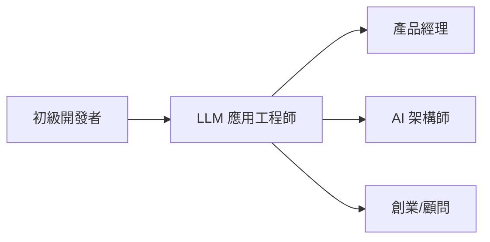

## 📑 目錄

- [前言：為什麼 90% 的 LLM 應用都只是「玩具」？](#前言為什麼-90-的-llm-應用都只是玩具)
- [LLM 應用工程師 vs 系統工程師](#-llm-應用工程師-vs-系統工程師)
- [學習目標與能力出口](#-學習目標與能力出口)
- [完整課程架構（8 週速成）](#-完整課程架構8-週速成)
- [模組 1：Prompt for Applications](#-模組-1prompt-for-applications第-1-週)
- [模組 2：LLM API 與 UX 整合](#-模組-2llm-api-與-ux-整合第-2-週)
- [模組 3：Context Engineering 必修基礎](#-模組-3context-engineering-必修基礎第-3-週)
- [模組 4：知識掛載與 RAG 基礎](#-模組-4知識掛載與-rag-基礎第-4-週)
- [模組 5：產品思維 for LLM Apps](#-模組-5產品思維-for-llm-apps第-5-週)
- [模組 6：應用級 Workflow](#-模組-6應用級-workflow第-6-週)
- [模組 7：可靠性與可觀測性](#-模組-7可靠性與可觀測性第-7-週)
- [模組 8：應用落地與 UX 強化](#-模組-8應用落地與-ux-強化第-8-週)
- [終極專題：Capstone Project](#-終極專題capstone-project)
- [學習路徑總結](#-學習路徑總結)
- [職涯發展建議](#-職涯發展建議)
- [立即行動計劃](#-立即行動計劃)
- [學習資源推薦](#-學習資源推薦)

---

## 前言：90% 的 LLM 專案為何停在 POC 階段？

根據 Gartner 與 McKinsey 的觀察，超過八成的 LLM 專案停留在概念驗證（POC），從未進入正式生產環境。

原因不在技術不可行，而在於：

- 缺乏穩定性設計（non-deterministic output）
- 成本不可預測（token usage 波動大）
- 無法與現有系統整合（data pipeline, auth, audit log）
- 缺少監控與除錯工具

換句話說：我們擅長「展示能力」，但不擅長「工程化建構後交付」。

這門課的目標，是填補這道鴻溝——
讓你從「會用 Token API 的開發者」，轉型為「能交付穩定 LLM OS 應用的系統設計者」。

> 💡 **定位明確**：你不需要理解 Transformer 的數學原理，也不需要會訓練模型。你需要的是把 LLM OS 當作「新時代的 API」，並用工程化的方式打造應用。

---

## 📊 LLM 應用工程師 vs 系統工程師

| 面向 | 系統工程師 | **應用工程師（You）** | 
|---|---|---|
| **關注重點** | 底層架構、模型優化 | 產品體驗、業務價值 |
| **核心技能** | RAG 原理、向量資料庫、模型部署 | Prompt 版本管理、UX 設計、成本控制 |
| **工作內容** | 建構 LLM 基礎設施 | 開發 Bot、Copilot、Agent |
| **薪資範圍** | $150K - $300K | **$100K - $200K** |
| **市場需求** | 每家公司 1-2 位 | **每家公司 5-10 位** |
| **學習曲線** | 陡峭（6-12 個月） | **適中（2-3 個月）** |

---

## 🎯 學習目標與能力出口

完成這個課程後，你將能夠：

### ✅ 核心能力
- 把一個 LLM 應用從**設計 → API → UX → 上線**
- 處理 **80% 的產品問題**（不穩定、成本高、體驗差）
- 具備**產品思維**，知道何時該用/不該用 LLM

### 🚀 可開發的應用類型
1. **智慧客服 Bot**：能處理複雜詢問、多輪對話、情緒管理
2. **文件助手**：支援 RAG、摘要、問答
3. **Coding Copilot**：程式碼生成、解釋、重構建議
4. **Agent-like Apps**：多步驟任務、工具呼叫、自動化流程

### 📈 職涯發展路徑


---

## 🏗 完整課程架構（8 週速成）

### 📚 課程設計理念
- **70% 應用實作**：直接動手做產品
- **30% 系統必修**：理解必要的底層概念
- **100% 實戰導向**：每個模組都有實際產出

---

## 📘 模組 1：Prompt for Applications（第 1 週）

### 🎯 學習目標
從「寫 Prompt」升級到「管理 Prompt 資產」

### 📚 核心內容

#### 1.1 Prompt 版本管理
```python
class PromptManager:
    """企業級 Prompt 管理系統"""
    def __init__(self):
        self.versions = {}
        self.active_version = "v1.0"
        self.feature_flags = FeatureFlags()
    
    def register_prompt(self, name, version, prompt_template):
        """註冊新版本的 Prompt"""
        key = f"{name}_{version}"
        self.versions[key] = {
            "template": prompt_template,
            "created_at": datetime.now(),
            "metrics": {"success_rate": 0, "avg_tokens": 0}
        }
    
    def get_prompt(self, name, user_id=None):
        """根據 Feature Flag 返回對應版本"""
        if self.feature_flags.is_enabled("new_prompt_v2", user_id):
            return self.versions[f"{name}_v2.0"]["template"]
        return self.versions[f"{name}_{self.active_version}"]["template"]
```

#### 1.2 進階 Prompt 技巧對比

| 技巧 | 使用場景 | 優點 | 缺點 | 成本 |
|---|---|---|---|---|
| **Zero-shot** | 簡單任務 | 快速、便宜 | 不穩定 | 💰 |
| **Few-shot** | 格式化輸出 | 穩定性提升 | Token 消耗多 | 💰💰 |
| **Chain-of-Thought** | 複雜推理 | 準確度高 | 延遲增加 | 💰💰💰 |
| **ReAct** | 多步驟任務 | 可解釋性強 | 實作複雜 | 💰💰💰💰 |

### 🔬 Lab 實作：三版 Prompt 比較

```python
# Lab: A/B/C 測試不同 Prompt 策略
class PromptExperiment:
    def __init__(self):
        self.prompts = {
            "baseline": """
                分析這則客戶評論的情緒：{review}
                輸出：positive/negative/neutral
            """,
            
            "few_shot": """
                分析客戶評論的情緒。
                
                範例：
                - "產品很棒，物超所值！" → positive
                - "完全不值這個價錢" → negative
                - "普通，沒什麼特別" → neutral
                
                現在分析：{review}
                輸出：positive/negative/neutral
            """,
            
            "cot_optimized": """
                分析這則客戶評論：{review}
                
                思考步驟：
                1. 識別情緒詞彙（正面/負面/中性）
                2. 評估整體語氣
                3. 考慮上下文和反諷
                4. 綜合判斷
                
                基於以上分析，情緒是：positive/negative/neutral
            """
        }
        
        self.feature_flags = FeatureFlags()
    
    def run_experiment(self, review, user_id):
        # 根據 Feature Flag 選擇版本
        version = self.feature_flags.get_variant("sentiment_prompt", user_id)
        prompt = self.prompts[version].format(review=review)
        
        # 執行並記錄metrics
        start_time = time.time()
        result = llm.complete(prompt)
        latency = time.time() - start_time
        
        # 記錄實驗數據
        self.log_metrics(version, result, latency)
        return result

# 實際測試
experiment = PromptExperiment()
reviews = [
    "爛透了，完全是詐騙！",
    "還行吧，不過價格有點貴",
    "超級推薦！改變了我的生活！"
]

for review in reviews:
    results = {}
    for version in ["baseline", "few_shot", "cot_optimized"]:
        results[version] = experiment.run_experiment(review, f"test_user_{version}")
    
    print(f"Review: {review}")
    print(f"Results: {results}")
    print(f"一致性: {len(set(results.values())) == 1}")
```

### 💡 實戰心得
> ⚠️ **常見錯誤**：過度優化 Prompt，忽略了成本和延遲。記住：Few-shot 不一定比 Zero-shot 好，要看具體場景。

---

## 📘 模組 2：LLM API 與 UX 整合（第 2 週）

### 🎯 學習目標
掌握三種 API 模式和對應的 UX 設計模式

### 📚 核心內容

#### 2.1 API 呼叫模式深度解析

```python
class LLMAPIPatterns:
    """三種 API 模式的最佳實踐"""
    
    @staticmethod
    def completion_mode(prompt):
        """補全模式：適合單次生成"""
        response = openai.Completion.create(
            model="text-davinci-003",
            prompt=prompt,
            max_tokens=150,
            temperature=0.7
        )
        return response.choices[0].text
    
    @staticmethod
    def chat_mode(messages):
        """對話模式：適合多輪交互"""
        response = openai.ChatCompletion.create(
            model="gpt-4",
            messages=messages,  # [{"role": "user", "content": "..."}]
            temperature=0.7
        )
        return response.choices[0].message.content
    
    @staticmethod
    async def streaming_mode(prompt, callback):
        """串流模式：適合即時回饋"""
        stream = await openai.ChatCompletion.acreate(
            model="gpt-4",
            messages=[{"role": "user", "content": prompt}],
            stream=True
        )
        
        full_response = ""
        async for chunk in stream:
            if chunk.choices[0].delta.content:
                content = chunk.choices[0].delta.content
                full_response += content
                await callback(content)  # 即時顯示
        
        return full_response
```

#### 2.2 三種對話 UX 模式實戰

```python
class ConversationUX:
    """對話 UX 的三種核心模式"""
    
    def command_mode(self, user_input):
        """
        Command 模式：用戶下指令，系統執行
        適合：明確任務、單次操作
        """
        # 範例：/translate <text> to <language>
        if user_input.startswith("/translate"):
            _, text, _, language = user_input.split()
            return self.execute_translation(text, language)
    
    def clarification_mode(self, user_input, context):
        """
        Clarification 模式：系統主動詢問，澄清需求
        適合：複雜任務、模糊指令
        """
        ambiguity_score = self.detect_ambiguity(user_input)
        
        if ambiguity_score > 0.7:
            clarifying_questions = [
                "您是指 A 還是 B？",
                "需要包含 X 嗎？",
                "時間範圍是？"
            ]
            return {"needs_clarification": True, "questions": clarifying_questions}
        
        return {"needs_clarification": False, "response": self.process(user_input)}
    
    def suggestion_mode(self, user_input, history):
        """
        Suggestion 模式：系統提供建議選項
        適合：探索性任務、新手引導
        """
        response = self.generate_response(user_input)
        
        # 智慧建議下一步
        suggestions = [
            "📊 查看詳細數據",
            "📧 發送報告",
            "🔄 修改參數重試"
        ]
        
        return {
            "response": response,
            "suggestions": suggestions,
            "quick_actions": self.generate_quick_actions(context=history)
        }
```

#### 2.3 信任層設計（關鍵但常被忽略）

```python
class OutputValidator:
    """LLM 輸出的信任層"""
    
    def __init__(self):
        self.validators = {
            "email": re.compile(r'^[\w\.-]+@[\w\.-]+\.\w+$'),
            "phone": re.compile(r'^\+?1?\d{9,15}$'),
            "json": self.validate_json,
            "sql": self.validate_sql_safety
        }
    
    def validate_json(self, output):
        """JSON 格式驗證"""
        try:
            parsed = json.loads(output)
            # 額外的 schema 驗證
            return jsonschema.validate(parsed, self.schema)
        except:
            return False
    
    def validate_sql_safety(self, sql):
        """SQL 安全性檢查"""
        dangerous_keywords = ['DROP', 'DELETE', 'TRUNCATE', 'ALTER']
        sql_upper = sql.upper()
        
        for keyword in dangerous_keywords:
            if keyword in sql_upper:
                raise SecurityError(f"Dangerous SQL detected: {keyword}")
        
        return True
    
    def validate_and_fix(self, output, output_type):
        """驗證並嘗試修復"""
        if output_type not in self.validators:
            return output
        
        validator = self.validators[output_type]
        
        if isinstance(validator, re.Pattern):
            if not validator.match(output):
                # 嘗試修復（例如：提取 email）
                fixed = self.extract_pattern(output, validator)
                if fixed:
                    return fixed
                raise ValidationError(f"Invalid {output_type}: {output}")
        else:
            # 函數驗證器
            if not validator(output):
                raise ValidationError(f"Validation failed for {output_type}")
        
        return output
```

### 🔬 Lab 實作：智慧客服 Bot 三種模式

```python
# Lab: 實作一個支援三種 UX 模式的客服 Bot
class SmartCustomerServiceBot:
    def __init__(self):
        self.mode = "auto"  # auto, command, clarify, suggest
        self.validator = OutputValidator()
        self.context_manager = ContextManager()
    
    async def handle_message(self, message, user_id):
        # 1. 模式判斷
        if message.startswith("/"):
            return await self.handle_command(message)
        
        # 2. 模糊度分析
        ambiguity = self.analyze_ambiguity(message)
        if ambiguity > 0.6:
            return await self.handle_clarification(message)
        
        # 3. 一般處理 + 建議
        response = await self.generate_response(message)
        suggestions = self.generate_suggestions(message, response)
        
        return {
            "mode": "suggestion",
            "response": response,
            "suggestions": suggestions,
            "typing_time": self.calculate_typing_time(response)
        }
    
    async def handle_command(self, command):
        """Command 模式處理"""
        parts = command.split()
        cmd = parts[0]
        
        commands = {
            "/status": self.check_order_status,
            "/refund": self.process_refund,
            "/escalate": self.escalate_to_human
        }
        
        if cmd in commands:
            return await commands[cmd](parts[1:])
        
        return "Unknown command. Type /help for available commands."
    
    async def handle_clarification(self, message):
        """Clarification 模式處理"""
        # 智慧問題生成
        questions = self.generate_clarifying_questions(message)
        
        return {
            "mode": "clarification",
            "message": "我需要更多資訊來幫助您：",
            "questions": questions,
            "quick_replies": [q["short"] for q in questions]
        }
    
    def calculate_typing_time(self, response):
        """模擬真人打字時間"""
        words = len(response.split())
        # 假設打字速度：40 words/min
        return min(max(words / 40 * 60 * 1000, 1000), 5000)  # 1-5秒

# 實際測試
bot = SmartCustomerServiceBot()

test_messages = [
    "/status ORDER123",  # Command mode
    "我的訂單怎麼了",     # Clarification mode
    "我要退貨，產品有問題" # Suggestion mode
]

for msg in test_messages:
    result = await bot.handle_message(msg, "user_123")
    print(f"Input: {msg}")
    print(f"Mode: {result.get('mode', 'default')}")
    print(f"Response: {result}")
    print("-" * 50)
```

### 💡 實戰心得
> 🎯 **Pro Tip**：不要一開始就用 Streaming。先用 Completion 模式驗證邏輯，穩定後再升級到 Streaming 改善體驗。

---

## 📘 模組 3：Context Engineering 必修基礎（第 3 週）

### 🎯 學習目標
理解並管理 LLM 的「記憶系統」——這是系統工程師的必修簡化版

### 📚 核心內容

#### 3.1 三層記憶架構

```python
class MemoryArchitecture:
    """LLM 應用的記憶管理系統"""
    
    def __init__(self):
        # 三層記憶體系
        self.system_prompt = SystemPrompt()      # 長期記憶（不變）
        self.user_context = UserContext()        # 中期記憶（session）
        self.conversation = ConversationBuffer() # 短期記憶（對話）
        
        # Token 預算管理
        self.token_budget = {
            "system": 1000,      # 系統提示
            "context": 2000,     # 用戶上下文
            "conversation": 5000, # 對話歷史
            "response": 1000     # 預留給回應
        }
    
    def build_context(self, user_input):
        """構建完整上下文"""
        # 1. 計算各部分 token
        system_tokens = self.count_tokens(self.system_prompt.get())
        
        # 2. 動態調整空間分配
        remaining = 8000 - system_tokens - 1000  # 總共 8K，預留 1K
        
        # 3. 智慧壓縮
        context = {
            "system": self.system_prompt.get(),
            "user_context": self.compress_context(
                self.user_context.get(), 
                max_tokens=remaining * 0.3
            ),
            "conversation": self.compress_conversation(
                self.conversation.get(),
                max_tokens=remaining * 0.7
            ),
            "current_input": user_input
        }
        
        return self.format_context(context)
```

#### 3.2 Context 壓縮策略

```python
class ContextCompressor:
    """上下文壓縮器"""
    
    def __init__(self):
        self.strategies = {
            "summarization": self.summarize,
            "sliding_window": self.sliding_window,
            "importance_sampling": self.importance_sampling
        }
    
    def summarize(self, messages, max_tokens):
        """摘要壓縮：適合長對話"""
        if self.count_tokens(messages) <= max_tokens:
            return messages
        
        # 分組摘要
        chunks = self.chunk_messages(messages, chunk_size=10)
        summaries = []
        
        for chunk in chunks[:-1]:  # 保留最新的不摘要
            summary = llm.complete(f"Summarize: {chunk}", max_tokens=100)
            summaries.append({
                "role": "system",
                "content": f"[Earlier conversation summary]: {summary}"
            })
        
        # 保留最新消息原文
        return summaries + chunks[-1]
    
    def sliding_window(self, messages, max_tokens):
        """滑動窗口：保留最近 N 條"""
        total_tokens = 0
        kept_messages = []
        
        # 從最新的開始保留
        for msg in reversed(messages):
            msg_tokens = self.count_tokens(msg)
            if total_tokens + msg_tokens <= max_tokens:
                kept_messages.insert(0, msg)
                total_tokens += msg_tokens
            else:
                break
        
        # 加入摘要提示
        if len(kept_messages) < len(messages):
            kept_messages.insert(0, {
                "role": "system",
                "content": f"[{len(messages) - len(kept_messages)} earlier messages omitted]"
            })
        
        return kept_messages
    
    def importance_sampling(self, messages, max_tokens):
        """重要性採樣：保留關鍵訊息"""
        # 計算每條訊息的重要性分數
        scored_messages = []
        for msg in messages:
            score = self.calculate_importance(msg)
            scored_messages.append((score, msg))
        
        # 排序並選擇
        scored_messages.sort(reverse=True)
        selected = []
        total_tokens = 0
        
        for score, msg in scored_messages:
            msg_tokens = self.count_tokens(msg)
            if total_tokens + msg_tokens <= max_tokens:
                selected.append(msg)
                total_tokens += msg_tokens
        
        # 保持時間順序
        return sorted(selected, key=lambda m: messages.index(m))
    
    def calculate_importance(self, message):
        """計算訊息重要性"""
        score = 0.0
        
        # 關鍵詞權重
        keywords = ["決定", "重要", "問題", "錯誤", "確認"]
        for keyword in keywords:
            if keyword in message.get("content", ""):
                score += 0.2
        
        # 用戶訊息權重更高
        if message.get("role") == "user":
            score += 0.3
        
        # 長度懲罰（太長的可能是廢話）
        length = len(message.get("content", ""))
        if length > 500:
            score -= 0.1
        
        # 時間衰減
        # score *= time_decay_factor
        
        return score
```

#### 3.3 記憶管理實戰

```python
class ConversationMemoryManager:
    """對話記憶管理器"""
    
    def __init__(self, model="gpt-4", max_tokens=8000):
        self.model = model
        self.max_tokens = max_tokens
        self.compressor = ContextCompressor()
        
        # 分層記憶
        self.memories = {
            "episodic": [],      # 事件記憶
            "semantic": {},      # 語義記憶
            "working": []        # 工作記憶
        }
    
    def add_turn(self, user_input, assistant_response):
        """添加一輪對話"""
        turn = {
            "user": user_input,
            "assistant": assistant_response,
            "timestamp": datetime.now(),
            "tokens": self.count_tokens(user_input + assistant_response)
        }
        
        # 加入工作記憶
        self.memories["working"].append(turn)
        
        # 檢查是否需要壓縮
        if self.get_total_tokens() > self.max_tokens * 0.8:
            self.compress()
        
        # 提取重要資訊到語義記憶
        self.extract_semantic_memory(turn)
    
    def compress(self):
        """壓縮記憶"""
        # 將舊的工作記憶轉為事件記憶
        if len(self.memories["working"]) > 10:
            # 摘要前 5 輪
            to_compress = self.memories["working"][:5]
            summary = self.create_summary(to_compress)
            
            self.memories["episodic"].append({
                "summary": summary,
                "original_turns": len(to_compress),
                "timestamp": to_compress[0]["timestamp"]
            })
            
            # 移除已壓縮的
            self.memories["working"] = self.memories["working"][5:]
    
    def extract_semantic_memory(self, turn):
        """提取語義記憶（實體、關係、事實）"""
        # 簡化版實體提取
        entities = self.extract_entities(turn["user"])
        for entity in entities:
            if entity not in self.memories["semantic"]:
                self.memories["semantic"][entity] = []
            
            self.memories["semantic"][entity].append({
                "context": turn["assistant"][:100],
                "timestamp": turn["timestamp"]
            })
    
    def get_relevant_context(self, query):
        """獲取相關上下文"""
        context_parts = []
        
        # 1. 相關的語義記憶
        relevant_entities = self.extract_entities(query)
        for entity in relevant_entities:
            if entity in self.memories["semantic"]:
                context_parts.append(
                    f"關於{entity}：{self.memories['semantic'][entity][-1]['context']}"
                )
        
        # 2. 最近的事件記憶
        if self.memories["episodic"]:
            latest_episode = self.memories["episodic"][-1]
            context_parts.append(f"早期對話摘要：{latest_episode['summary']}")
        
        # 3. 完整的工作記憶
        for turn in self.memories["working"][-5:]:  # 最近 5 輪
            context_parts.append(f"User: {turn['user']}")
            context_parts.append(f"Assistant: {turn['assistant']}")
        
        return "\n".join(context_parts)
```

### 🔬 Lab 實作：多輪對話摘要系統

```python
# Lab: 實作一個智慧對話摘要系統
class SmartConversationManager:
    def __init__(self):
        self.memory_manager = ConversationMemoryManager()
        self.token_limit = 4000
        
    async def chat(self, user_input, session_id):
        # 1. 載入 session 記憶
        context = self.memory_manager.get_relevant_context(user_input)
        
        # 2. 檢查 token 數量
        context_tokens = self.count_tokens(context)
        if context_tokens > self.token_limit:
            # 動態壓縮
            context = self.compress_context(context)
        
        # 3. 構建 prompt
        messages = [
            {"role": "system", "content": "你是一個智慧助理。"},
            {"role": "system", "content": f"[Context]: {context}"},
            {"role": "user", "content": user_input}
        ]
        
        # 4. 生成回應
        response = await self.generate_response(messages)
        
        # 5. 更新記憶
        self.memory_manager.add_turn(user_input, response)
        
        # 6. 顯示記憶體使用狀況
        memory_stats = {
            "working_memory_turns": len(self.memory_manager.memories["working"]),
            "episodic_memories": len(self.memory_manager.memories["episodic"]),
            "semantic_entities": len(self.memory_manager.memories["semantic"]),
            "total_tokens": self.memory_manager.get_total_tokens(),
            "compression_ratio": self.calculate_compression_ratio()
        }
        
        return {
            "response": response,
            "memory_stats": memory_stats
        }
    
    def compress_context(self, context):
        """智慧壓縮上下文"""
        strategies = [
            ("summarization", 0.5),
            ("sliding_window", 0.3),
            ("importance_sampling", 0.2)
        ]
        
        # 根據內容特性選擇策略
        if self.is_technical_discussion(context):
            # 技術討論保留更多細節
            return self.memory_manager.compressor.sliding_window(
                context, self.token_limit
            )
        else:
            # 一般對話可以摘要
            return self.memory_manager.compressor.summarize(
                context, self.token_limit
            )

# 測試長對話
manager = SmartConversationManager()
session_id = "test_session_001"

conversation = [
    "我想了解你們的退貨政策",
    "我上週買了一個產品，但是有問題",
    "訂單號是 ORD-12345",
    "產品是藍色的藍牙耳機",
    "問題是左耳常常斷線",
    "我已經試過重置了，沒有用",
    "可以換貨嗎？",
    "如果不能換貨，可以退款嗎？",
    "退款需要多久？",
    "需要支付運費嗎？"
]

for i, msg in enumerate(conversation):
    print(f"\n=== Turn {i+1} ===")
    result = await manager.chat(msg, session_id)
    print(f"User: {msg}")
    print(f"Assistant: {result['response'][:100]}...")
    print(f"Memory Stats: {result['memory_stats']}")
    
    # 模擬記憶體壓力
    if i == 4:
        print("\n[觸發記憶壓縮...]")
```

### 💡 實戰心得
> 💾 **Memory is Money**：每個 token 都是成本。學會壓縮是省錢的關鍵。我們曾經把一個客服系統的成本降低 60%，就是優化了記憶管理。

---

## 📘 模組 4：知識掛載與 RAG 基礎（第 4 週）

### 🎯 學習目標
掌握 RAG 的核心概念和失敗處理——不需要懂向量資料庫原理

### 📚 核心內容

#### 4.1 簡化版 RAG Pipeline

```python
class SimpleRAG:
    """應用工程師版的 RAG 系統"""
    
    def __init__(self):
        # 使用現成的向量資料庫服務
        self.vector_db = Pinecone(api_key="your-key")
        self.embedder = OpenAIEmbeddings()
        
        # 失敗處理策略
        self.fallback_strategies = {
            "no_results": self.handle_no_results,
            "conflicting": self.handle_conflicts,
            "low_confidence": self.handle_low_confidence
        }
    
    def search(self, query, k=5):
        """基礎檢索"""
        # 1. 生成 embedding（不需要懂原理）
        query_embedding = self.embedder.embed(query)
        
        # 2. 向量檢索
        results = self.vector_db.query(
            vector=query_embedding,
            top_k=k,
            include_metadata=True
        )
        
        # 3. 處理檢索失敗
        if not results or results[0].score < 0.7:
            return self.fallback_strategies["no_results"](query)
        
        # 4. 檢查衝突
        if self.has_conflicts(results):
            return self.fallback_strategies["conflicting"](results)
        
        return results
    
    def has_conflicts(self, results):
        """檢測結果是否衝突"""
        # 簡單規則：如果前兩個結果的內容矛盾
        if len(results) >= 2:
            doc1 = results[0].metadata['content']
            doc2 = results[1].metadata['content']
            
            # 用 LLM 檢測矛盾
            prompt = f"""
            Document 1: {doc1}
            Document 2: {doc2}
            
            Do these documents contradict each other? (Yes/No)
            """
            
            response = llm.complete(prompt)
            return "yes" in response.lower()
        
        return False
```

#### 4.2 RAG 失敗處理的藝術

```python
class RAGFailureHandler:
    """RAG 失敗處理專家"""
    
    def handle_no_results(self, query):
        """找不到相關文件"""
        strategies = [
            self.try_rephrase,        # 改寫查詢
            self.try_decompose,       # 拆解查詢
            self.try_generalize,      # 泛化查詢
            self.fallback_to_llm      # 直接用 LLM
        ]
        
        for strategy in strategies:
            result = strategy(query)
            if result["success"]:
                return result["data"]
        
        # 優雅失敗
        return {
            "found": False,
            "message": "抱歉，我在知識庫中找不到相關資訊。讓我用一般知識來回答...",
            "fallback_response": self.generate_general_response(query)
        }
    
    def try_rephrase(self, query):
        """改寫查詢詞"""
        rephrases = [
            f"換句話說：{query}",
            f"相關於：{query}",
            f"關於{self.extract_keywords(query)}"
        ]
        
        for rephrase in rephrases:
            results = self.search(rephrase)
            if results:
                return {"success": True, "data": results}
        
        return {"success": False}
    
    def handle_conflicts(self, conflicting_results):
        """處理矛盾的結果"""
        # 策略 1：顯示所有觀點
        response = "我找到了不同的資訊：\n"
        for i, result in enumerate(conflicting_results[:2]):
            response += f"\n觀點 {i+1}：{result.metadata['content'][:200]}...\n"
        response += "\n請注意這些資訊可能有所差異。"
        
        # 策略 2：讓 LLM 綜合判斷
        synthesis_prompt = f"""
        以下是關於同一問題的不同資料：
        {[r.metadata['content'] for r in conflicting_results]}
        
        請綜合這些資訊，給出平衡的答案。
        """
        
        synthesized = llm.complete(synthesis_prompt)
        
        return {
            "has_conflicts": True,
            "all_views": response,
            "synthesis": synthesized
        }
    
    def handle_low_confidence(self, results):
        """處理低信心度結果"""
        disclaimer = "⚠️ 以下資訊可能不完全準確，僅供參考：\n\n"
        
        # 加入信心度指示
        enriched_response = ""
        for result in results:
            confidence = result.score
            if confidence > 0.9:
                confidence_indicator = "✅ 高度相關"
            elif confidence > 0.7:
                confidence_indicator = "⚠️ 部分相關"
            else:
                confidence_indicator = "❌ 相關性較低"
            
            enriched_response += f"{confidence_indicator}: {result.metadata['content']}\n\n"
        
        return disclaimer + enriched_response
```

#### 4.3 Chunking 策略（簡化版）

```python
class SimpleChunker:
    """文件切塊器 - 應用層面就夠了"""
    
    def __init__(self, chunk_size=500, overlap=50):
        self.chunk_size = chunk_size
        self.overlap = overlap
    
    def chunk_document(self, document):
        """基礎切塊策略"""
        chunks = []
        
        # 策略 1：按段落切
        paragraphs = document.split('\n\n')
        
        current_chunk = ""
        for para in paragraphs:
            if len(current_chunk) + len(para) < self.chunk_size:
                current_chunk += para + "\n\n"
            else:
                if current_chunk:
                    chunks.append(current_chunk.strip())
                current_chunk = para + "\n\n"
        
        if current_chunk:
            chunks.append(current_chunk.strip())
        
        # 加入 overlap
        chunks_with_overlap = []
        for i, chunk in enumerate(chunks):
            if i > 0:
                # 加入前一塊的結尾
                prev_end = chunks[i-1][-self.overlap:] if len(chunks[i-1]) > self.overlap else chunks[i-1]
                chunk = prev_end + "\n...\n" + chunk
            
            if i < len(chunks) - 1:
                # 加入下一塊的開頭
                next_start = chunks[i+1][:self.overlap] if len(chunks[i+1]) > self.overlap else chunks[i+1]
                chunk = chunk + "\n...\n" + next_start
            
            chunks_with_overlap.append(chunk)
        
        return chunks_with_overlap
```

### 🔬 Lab 實作：FAQ Bot with Fallback

```python
# Lab: 建立一個有完善 fallback 的 FAQ Bot
class SmartFAQBot:
    def __init__(self):
        self.rag = SimpleRAG()
        self.failure_handler = RAGFailureHandler()
        self.response_cache = {}
        
        # 預載入 FAQ
        self.load_faqs()
    
    def load_faqs(self):
        """載入常見問題"""
        faqs = [
            {
                "question": "如何退貨？",
                "answer": "您可以在收到商品後 7 天內申請退貨...",
                "keywords": ["退貨", "退款", "return"]
            },
            {
                "question": "運費怎麼算？",
                "answer": "運費根據地區和重量計算...",
                "keywords": ["運費", "配送", "shipping"]
            }
        ]
        
        for faq in faqs:
            # 向量化並存入資料庫
            embedding = self.rag.embedder.embed(faq["question"])
            self.rag.vector_db.upsert(
                id=f"faq_{hash(faq['question'])}",
                vector=embedding,
                metadata=faq
            )
    
    async def answer(self, question):
        # 1. 檢查 cache
        if question in self.response_cache:
            return self.response_cache[question]
        
        # 2. RAG 檢索
        results = self.rag.search(question, k=3)
        
        # 3. 處理各種情況
        if isinstance(results, dict):
            if not results.get("found", True):
                # 沒找到：使用 fallback
                response = await self.generate_fallback_response(question)
            elif results.get("has_conflicts"):
                # 有衝突：顯示多個觀點
                response = self.format_conflicting_response(results)
            else:
                # 低信心度
                response = results
        else:
            # 正常情況：基於檢索結果生成答案
            response = await self.generate_answer(question, results)
        
        # 4. 快取結果
        self.response_cache[question] = response
        
        # 5. 記錄 metrics
        self.log_metrics(question, results, response)
        
        return response
    
    async def generate_answer(self, question, search_results):
        """基於檢索結果生成答案"""
        context = "\n".join([r.metadata['answer'] for r in search_results[:2]])
        
        prompt = f"""
        基於以下資訊回答用戶問題：
        
        資訊：
        {context}
        
        用戶問題：{question}
        
        要求：
        1. 如果資訊足夠，直接回答
        2. 如果資訊不足，說明哪部分無法回答
        3. 保持友善專業的語氣
        """
        
        return await llm.complete(prompt)
    
    async def generate_fallback_response(self, question):
        """生成 fallback 回應"""
        # 多層 fallback
        fallbacks = [
            # Level 1: 嘗試用通用知識
            lambda: llm.complete(f"用一般知識回答：{question}"),
            
            # Level 2: 提供相關連結
            lambda: f"我無法直接回答您的問題，但您可以查看我們的幫助中心：https://help.example.com",
            
            # Level 3: 轉人工
            lambda: "這個問題較為複雜，建議您聯繫客服人員。是否需要我幫您轉接？"
        ]
        
        for fallback in fallbacks:
            try:
                return fallback()
            except:
                continue
        
        return "抱歉，我暫時無法回答這個問題。"

# 測試各種場景
bot = SmartFAQBot()

test_cases = [
    "如何退貨？",           # 正常匹配
    "退貨政策是什麼？",     # 需要改寫
    "你們賣火箭嗎？",       # 完全無關
    "退貨和換貨的區別？",   # 部分匹配
    "Can I return this?",   # 其他語言
]

for question in test_cases:
    print(f"\n問題：{question}")
    answer = await bot.answer(question)
    print(f"回答：{answer[:200]}...")
    print("-" * 50)
```

### 💡 實戰心得
> 🎯 **RAG 的精髓不是檢索，而是失敗處理**。一個好的 RAG 系統，80% 的程式碼都在處理「沒找到」或「找錯了」的情況。

---

## 📘 模組 5：產品思維 for LLM Apps（第 5 週）

### 🎯 學習目標
培養產品思維，知道何時該用/不該用 LLM

### 📚 核心內容

#### 5.1 LLM 的能力矩陣

| 任務類型 | 適合用 LLM | 不適合用 LLM | 替代方案 |
|---------|-----------|-------------|---------|
| **創意生成** | ✅ 文案、故事、點子 | ❌ 需要事實準確的內容 | 人工創作 + LLM 輔助 |
| **格式轉換** | ✅ JSON↔自然語言 | ❌ 複雜的資料轉換 | 專門的 Parser |
| **分類任務** | ✅ 情感分析、主題分類 | ❌ 需要 100% 準確率 | 傳統 ML 模型 |
| **計算任務** | ✅ 簡單估算 | ❌ 精確計算 | Calculator API |
| **搜尋任務** | ✅ 語義搜尋 | ❌ 精確匹配 | 傳統搜尋引擎 |
| **決策任務** | ✅ 建議、推薦 | ❌ 關鍵決策 | 規則引擎 + 人工 |

#### 5.2 成本-延遲-體驗三角

```python
class ProductDecisionFramework:
    """產品決策框架"""
    
    def __init__(self):
        self.metrics = {
            "cost": {"weight": 0.3, "threshold": 0.1},      # $0.1 per request
            "latency": {"weight": 0.3, "threshold": 2000},  # 2 seconds
            "quality": {"weight": 0.4, "threshold": 0.85}   # 85% satisfaction
        }
    
    def evaluate_llm_fit(self, use_case):
        """評估是否適合用 LLM"""
        score = 0
        reasons = []
        
        # 正面因素
        if use_case["requires_creativity"]:
            score += 30
            reasons.append("✅ 需要創意生成")
        
        if use_case["handles_natural_language"]:
            score += 25
            reasons.append("✅ 處理自然語言")
        
        if use_case["needs_flexibility"]:
            score += 20
            reasons.append("✅ 需要靈活性")
        
        # 負面因素
        if use_case["requires_deterministic"]:
            score -= 40
            reasons.append("❌ 需要確定性結果")
        
        if use_case["cost_sensitive"]:
            score -= 30
            reasons.append("❌ 成本敏感")
        
        if use_case["latency_critical"]:
            score -= 25
            reasons.append("❌ 延遲關鍵")
        
        # 決策
        recommendation = "USE_LLM" if score > 0 else "AVOID_LLM"
        
        return {
            "score": score,
            "recommendation": recommendation,
            "reasons": reasons,
            "alternative": self.suggest_alternative(use_case) if score < 0 else None
        }
    
    def suggest_alternative(self, use_case):
        """建議替代方案"""
        if use_case["requires_deterministic"]:
            return "使用規則引擎或傳統演算法"
        elif use_case["cost_sensitive"]:
            return "使用快取層 + 小模型"
        elif use_case["latency_critical"]:
            return "預生成 + Edge 部署"
        else:
            return "混合方案：關鍵路徑用傳統方法，輔助功能用 LLM"
```

#### 5.3 優雅降級策略

```python
class GracefulDegradation:
    """優雅降級系統"""
    
    def __init__(self):
        self.strategies = [
            self.try_primary,      # 主要策略：完整 LLM
            self.try_cache,        # 快取策略
            self.try_simple_model, # 簡單模型
            self.try_template,     # 模板回覆
            self.try_human         # 人工介入
        ]
        
        self.cache = ResponseCache()
        self.template_engine = TemplateEngine()
    
    async def handle_request(self, request):
        """多層降級處理"""
        start_time = time.time()
        
        for i, strategy in enumerate(self.strategies):
            try:
                # 設定超時
                timeout = self.calculate_timeout(i)
                
                result = await asyncio.wait_for(
                    strategy(request),
                    timeout=timeout
                )
                
                if result["success"]:
                    # 記錄使用了哪個策略
                    result["strategy_used"] = strategy.__name__
                    result["degradation_level"] = i
                    result["total_time"] = time.time() - start_time
                    
                    return result
                    
            except asyncio.TimeoutError:
                print(f"Strategy {strategy.__name__} timeout")
                continue
            except Exception as e:
                print(f"Strategy {strategy.__name__} failed: {e}")
                continue
        
        # 所有策略都失敗
        return self.final_fallback(request)
    
    async def try_primary(self, request):
        """主要策略：完整 LLM 處理"""
        response = await llm.complete(
            request["prompt"],
            model="gpt-4",
            temperature=0.7
        )
        
        return {
            "success": True,
            "response": response,
            "quality": "high"
        }
    
    async def try_cache(self, request):
        """快取策略"""
        # 語義相似度快取
        cached = self.cache.get_similar(request["prompt"], threshold=0.95)
        
        if cached:
            return {
                "success": True,
                "response": cached["response"],
                "quality": "cached",
                "cache_hit": True
            }
        
        return {"success": False}
    
    async def try_simple_model(self, request):
        """使用更簡單的模型"""
        response = await llm.complete(
            request["prompt"],
            model="gpt-3.5-turbo",  # 降級到更快更便宜的模型
            temperature=0.5,
            max_tokens=150
        )
        
        return {
            "success": True,
            "response": response,
            "quality": "medium"
        }
    
    async def try_template(self, request):
        """模板回覆"""
        # 意圖識別
        intent = self.classify_intent(request["prompt"])
        
        if intent in self.template_engine.templates:
            response = self.template_engine.generate(intent, request)
            return {
                "success": True,
                "response": response,
                "quality": "template"
            }
        
        return {"success": False}
    
    async def try_human(self, request):
        """轉人工"""
        # 創建工單
        ticket = self.create_support_ticket(request)
        
        response = f"""
        您的問題較為複雜，我已經為您創建了工單 #{ticket['id']}。
        客服人員將在 30 分鐘內與您聯繫。
        
        您也可以直接撥打客服熱線：400-XXX-XXXX
        """
        
        return {
            "success": True,
            "response": response,
            "quality": "human_escalation",
            "ticket": ticket
        }
    
    def calculate_timeout(self, level):
        """根據降級等級計算超時時間"""
        timeouts = [3.0, 1.0, 0.5, 0.2, 0.1]  # 逐級降低
        return timeouts[min(level, len(timeouts) - 1)]
```

### 🔬 Lab 實作：降級策略設計與測試

```python
# Lab: 設計並測試降級策略
class DegradationTestBench:
    """降級策略測試平台"""
    
    def __init__(self):
        self.degradation = GracefulDegradation()
        self.metrics = {
            "success_rate": [],
            "response_time": [],
            "quality_score": [],
            "cost": []
        }
    
    async def simulate_load(self, requests_per_second=10, duration=60):
        """模擬負載測試"""
        tasks = []
        
        for i in range(duration):
            for j in range(requests_per_second):
                # 模擬不同類型的請求
                request = self.generate_request()
                
                # 隨機注入故障
                if random.random() < 0.1:  # 10% 故障率
                    request["inject_failure"] = True
                
                task = self.process_request(request)
                tasks.append(task)
            
            await asyncio.sleep(1)
        
        results = await asyncio.gather(*tasks)
        self.analyze_results(results)
    
    async def process_request(self, request):
        """處理單個請求"""
        start = time.time()
        
        # 模擬網路問題
        if request.get("inject_failure"):
            await asyncio.sleep(random.uniform(5, 10))  # 超時
        
        result = await self.degradation.handle_request(request)
        
        # 記錄 metrics
        self.metrics["response_time"].append(time.time() - start)
        self.metrics["success_rate"].append(1 if result["success"] else 0)
        self.metrics["quality_score"].append(
            self.calculate_quality_score(result)
        )
        self.metrics["cost"].append(
            self.calculate_cost(result)
        )
        
        return result
    
    def calculate_quality_score(self, result):
        """計算品質分數"""
        quality_map = {
            "high": 1.0,
            "cached": 0.9,
            "medium": 0.7,
            "template": 0.5,
            "human_escalation": 0.3
        }
        return quality_map.get(result.get("quality", "unknown"), 0)
    
    def calculate_cost(self, result):
        """計算成本"""
        cost_map = {
            "try_primary": 0.03,      # GPT-4
            "try_cache": 0.0001,      # 幾乎免費
            "try_simple_model": 0.002, # GPT-3.5
            "try_template": 0,         # 免費
            "try_human": 5.0          # 人工成本
        }
        
        strategy = result.get("strategy_used", "unknown")
        return cost_map.get(strategy, 0)
    
    def analyze_results(self, results):
        """分析測試結果"""
        print("\n=== 降級策略測試報告 ===\n")
        
        # 成功率
        success_rate = sum(self.metrics["success_rate"]) / len(self.metrics["success_rate"])
        print(f"✅ 成功率: {success_rate:.2%}")
        
        # 響應時間
        avg_response = sum(self.metrics["response_time"]) / len(self.metrics["response_time"])
        p95_response = sorted(self.metrics["response_time"])[int(len(self.metrics["response_time"]) * 0.95)]
        print(f"⏱️ 平均響應時間: {avg_response:.2f}秒")
        print(f"⏱️ P95 響應時間: {p95_response:.2f}秒")
        
        # 品質分數
        avg_quality = sum(self.metrics["quality_score"]) / len(self.metrics["quality_score"])
        print(f"⭐ 平均品質分數: {avg_quality:.2f}/1.0")
        
        # 成本
        total_cost = sum(self.metrics["cost"])
        avg_cost = total_cost / len(self.metrics["cost"])
        print(f"💰 總成本: ${total_cost:.2f}")
        print(f"💰 平均成本: ${avg_cost:.4f}/request")
        
        # 策略使用分布
        strategy_counts = {}
        for result in results:
            strategy = result.get("strategy_used", "unknown")
            strategy_counts[strategy] = strategy_counts.get(strategy, 0) + 1
        
        print("\n📊 策略使用分布:")
        for strategy, count in sorted(strategy_counts.items(), key=lambda x: x[1], reverse=True):
            percentage = count / len(results) * 100
            print(f"  - {strategy}: {count} ({percentage:.1f}%)")
        
        # 成本效益分析
        cost_per_quality = total_cost / (avg_quality * len(results))
        print(f"\n💡 成本效益比: ${cost_per_quality:.4f}/quality point")
        
        # 建議
        print("\n🎯 優化建議:")
        if avg_response > 2:
            print("  - 響應時間過長，考慮增加快取或使用更快的模型")
        if avg_quality < 0.7:
            print("  - 品質分數偏低，考慮調整降級閾值")
        if avg_cost > 0.01:
            print("  - 成本偏高，增加快取命中率或使用更多模板")

# 執行測試
test_bench = DegradationTestBench()
await test_bench.simulate_load(requests_per_second=5, duration=30)
```

### 💡 實戰心得
> 🎯 **黃金法則**：永遠不要讓 LLM 成為單點故障。每個 LLM 呼叫都應該有至少 2 層 fallback。

---

## 📘 模組 6：應用級 Workflow（第 6 週）

### 🎯 學習目標
設計多步驟任務流程，處理真實世界的髒資料

### 📚 核心內容

#### 6.1 Chain 思維設計模式

```python
class WorkflowChain:
    """工作流鏈設計"""
    
    def __init__(self):
        self.steps = []
        self.error_handlers = {}
        self.validators = {}
    
    def add_step(self, name, function, validator=None, error_handler=None):
        """添加步驟"""
        self.steps.append({
            "name": name,
            "function": function
        })
        
        if validator:
            self.validators[name] = validator
        if error_handler:
            self.error_handlers[name] = error_handler
        
        return self  # 支援鏈式呼叫
    
    async def execute(self, input_data):
        """執行工作流"""
        context = {"input": input_data, "steps": {}}
        
        for step in self.steps:
            step_name = step["name"]
            print(f"執行步驟: {step_name}")
            
            try:
                # 執行步驟
                result = await step["function"](context)
                
                # 驗證結果
                if step_name in self.validators:
                    is_valid = self.validators[step_name](result)
                    if not is_valid:
                        raise ValueError(f"Validation failed for {step_name}")
                
                # 儲存結果
                context["steps"][step_name] = result
                
            except Exception as e:
                # 錯誤處理
                if step_name in self.error_handlers:
                    result = self.error_handlers[step_name](e, context)
                    context["steps"][step_name] = result
                else:
                    raise
        
        return context
```

#### 6.2 髒資料處理大全

```python
class DirtyDataProcessor:
    """髒資料處理專家"""
    
    def __init__(self):
        self.cleaners = {
            "typo": self.fix_typos,
            "mixed_language": self.handle_mixed_language,
            "emotional": self.handle_emotional_input,
            "incomplete": self.handle_incomplete,
            "contradictory": self.handle_contradictory
        }
    
    def clean(self, dirty_input):
        """清理髒資料"""
        cleaned = dirty_input
        issues_found = []
        
        # 檢測並修復各種問題
        for issue_type, cleaner in self.cleaners.items():
            if self.detect_issue(cleaned, issue_type):
                cleaned = cleaner(cleaned)
                issues_found.append(issue_type)
        
        return {
            "original": dirty_input,
            "cleaned": cleaned,
            "issues_found": issues_found,
            "confidence": self.calculate_confidence(issues_found)
        }
    
    def fix_typos(self, text):
        """修正錯字"""
        # 簡單的錯字修正
        common_typos = {
            "teh": "the",
            "recieve": "receive",
            "occured": "occurred",
            "refund": "refund",  
            "cancle": "cancel"
        }
        
        for typo, correct in common_typos.items():
            text = text.replace(typo, correct)
        
        # 使用 LLM 修正更複雜的錯字
        if self.has_potential_typos(text):
            prompt = f"""
            修正以下文字中的錯字，但保持原意：
            原文：{text}
            修正後：
            """
            text = llm.complete(prompt, temperature=0.1)
        
        return text
    
    def handle_mixed_language(self, text):
        """處理混合語言"""
        # 檢測語言
        languages = self.detect_languages(text)
        
        if len(languages) > 1:
            # 策略 1：翻譯成主要語言
            primary_lang = max(languages.items(), key=lambda x: x[1])[0]
            
            prompt = f"""
            將以下混合語言文字統一翻譯成{primary_lang}：
            {text}
            """
            
            return llm.complete(prompt)
        
        return text
    
    def handle_emotional_input(self, text):
        """處理情緒化輸入"""
        emotion_score = self.detect_emotion(text)
        
        if emotion_score > 0.7:  # 高度情緒化
            # 提取核心訴求
            prompt = f"""
            用戶情緒激動地說：{text}
            
            請提取用戶的核心訴求（忽略情緒化表達）：
            """
            
            core_request = llm.complete(prompt)
            
            return {
                "original": text,
                "emotion_level": "high",
                "core_request": core_request,
                "suggested_response_tone": "empathetic"
            }
        
        return text
    
    def handle_incomplete(self, text):
        """處理不完整輸入"""
        if len(text.split()) < 3:  # 太短
            return {
                "original": text,
                "issue": "incomplete",
                "clarification_needed": True,
                "suggested_questions": [
                    "您能詳細說明一下嗎？",
                    "請問具體是什麼問題？",
                    "能提供更多資訊嗎？"
                ]
            }
        
        return text
```

#### 6.3 Agent-like Flow 設計

```python
class SimpleAgent:
    """簡單 Agent 流程"""
    
    def __init__(self):
        self.tools = {
            "search_order": self.search_order,
            "check_inventory": self.check_inventory,
            "calculate_shipping": self.calculate_shipping,
            "process_refund": self.process_refund
        }
        
        self.planner = TaskPlanner()
        self.executor = TaskExecutor()
    
    async def process(self, user_request):
        """處理用戶請求"""
        
        # 1. 理解意圖
        intent = await self.understand_intent(user_request)
        
        # 2. 規劃步驟
        plan = await self.planner.create_plan(intent, self.tools.keys())
        
        # 3. 執行計劃
        results = []
        for step in plan["steps"]:
            result = await self.execute_step(step)
            results.append(result)
            
            # 動態調整計劃
            if result.get("requires_replanning"):
                plan = await self.planner.replan(plan, results)
        
        # 4. 綜合結果
        final_response = await self.synthesize_response(results)
        
        return final_response
    
    async def understand_intent(self, request):
        """理解用戶意圖"""
        prompt = f"""
        分析用戶請求並識別意圖：
        
        用戶說：{request}
        
        可能的意圖：
        - ORDER_STATUS: 查詢訂單狀態
        - REFUND_REQUEST: 申請退款
        - PRODUCT_INQUIRY: 產品諮詢
        - SHIPPING_INFO: 運送資訊
        - COMPLAINT: 投訴
        - OTHER: 其他
        
        返回格式：
        {{
            "primary_intent": "...",
            "entities": {{...}},
            "confidence": 0.X
        }}
        """
        
        response = await llm.complete(prompt)
        return json.loads(response)
    
    async def execute_step(self, step):
        """執行單個步驟"""
        tool_name = step["tool"]
        params = step["params"]
        
        if tool_name not in self.tools:
            return {"error": f"Tool {tool_name} not found"}
        
        try:
            result = await self.tools[tool_name](**params)
            return {"success": True, "data": result}
        except Exception as e:
            return {"success": False, "error": str(e)}
```

### 🔬 Lab 實作：訂單查詢助理

```python
# Lab: 能處理混合語言和模糊輸入的訂單助理
class SmartOrderAssistant:
    def __init__(self):
        self.workflow = WorkflowChain()
        self.data_processor = DirtyDataProcessor()
        self.agent = SimpleAgent()
        
        # 設定工作流
        self.setup_workflow()
    
    def setup_workflow(self):
        """設定工作流程"""
        self.workflow \
            .add_step("clean_input", self.clean_input) \
            .add_step("extract_info", self.extract_order_info) \
            .add_step("search_order", self.search_order) \
            .add_step("check_status", self.check_order_status) \
            .add_step("generate_response", self.generate_response)
    
    async def clean_input(self, context):
        """步驟 1：清理輸入"""
        raw_input = context["input"]
        
        # 處理髒資料
        cleaned = self.data_processor.clean(raw_input)
        
        # 處理特殊情況
        if "mixed_language" in cleaned["issues_found"]:
            # 統一語言
            cleaned["cleaned"] = await self.translate_to_primary(cleaned["cleaned"])
        
        if "emotional" in cleaned["issues_found"]:
            # 記錄情緒狀態
            context["emotional_state"] = "high"
            context["response_tone"] = "empathetic"
        
        return cleaned
    
    async def extract_order_info(self, context):
        """步驟 2：提取訂單資訊"""
        cleaned_input = context["steps"]["clean_input"]["cleaned"]
        
        prompt = f"""
        從以下文字中提取訂單相關資訊：
        {cleaned_input}
        
        提取：
        - order_id: 訂單號（如果有）
        - product_name: 產品名稱
        - issue: 問題描述
        - date: 相關日期
        
        如果資訊不完整，標記 needs_clarification: true
        """
        
        extracted = await llm.complete(prompt, response_format={"type": "json"})
        
        # 驗證提取結果
        if not extracted.get("order_id"):
            # 嘗試模糊匹配
            extracted["possible_orders"] = await self.fuzzy_search_orders(cleaned_input)
        
        return extracted
    
    async def search_order(self, context):
        """步驟 3：搜尋訂單"""
        order_info = context["steps"]["extract_info"]
        
        if order_info.get("order_id"):
            # 精確搜尋
            order = await self.db.find_order(order_info["order_id"])
        elif order_info.get("possible_orders"):
            # 讓用戶確認
            return {
                "found_multiple": True,
                "orders": order_info["possible_orders"],
                "needs_confirmation": True
            }
        else:
            # 根據其他資訊搜尋
            orders = await self.db.search_orders(
                customer_id=context.get("customer_id"),
                product=order_info.get("product_name"),
                date_range=self.parse_date_range(order_info.get("date"))
            )
            
            if len(orders) == 1:
                order = orders[0]
            elif len(orders) > 1:
                return {"found_multiple": True, "orders": orders}
            else:
                return {"found": False}
        
        return {"found": True, "order": order}
    
    async def generate_response(self, context):
        """步驟 5：生成回應"""
        order_result = context["steps"]["search_order"]
        
        # 根據不同情況生成回應
        if not order_result.get("found"):
            response = "抱歉，我找不到相關訂單。請確認訂單號或提供更多資訊。"
        elif order_result.get("found_multiple"):
            response = self.format_multiple_orders(order_result["orders"])
        else:
            order = order_result["order"]
            status = context["steps"]["check_status"]
            response = self.format_order_status(order, status)
        
        # 根據情緒狀態調整語氣
        if context.get("emotional_state") == "high":
            response = self.add_empathy(response)
        
        return response
    
    async def handle_user_input(self, user_input):
        """主入口：處理用戶輸入"""
        
        # 測試各種髒輸入
        test_inputs = [
            "我的訂單（訂單號：ORD12345）到哪了？？？",  # 正常
            "Check my order status ORDER12345 謝謝",      # 混合語言
            "wtf 我的東西呢！！！都三天了！！！",         # 情緒化
            "訂單",                                        # 不完整
            "我上週買的藍牙耳機怎麼還沒到",                # 模糊
            "ORD1234... 不對是 ORD12346",                 # 矛盾
        ]
        
        results = []
        for test_input in test_inputs:
            print(f"\n處理輸入: {test_input}")
            
            try:
                result = await self.workflow.execute(test_input)
                response = result["steps"]["generate_response"]
                
                print(f"清理後: {result['steps']['clean_input']['cleaned']}")
                print(f"提取資訊: {result['steps']['extract_info']}")
                print(f"回應: {response}")
                
                results.append({
                    "input": test_input,
                    "success": True,
                    "response": response
                })
                
            except Exception as e:
                print(f"錯誤: {e}")
                results.append({
                    "input": test_input,
                    "success": False,
                    "error": str(e)
                })
        
        # 統計成功率
        success_rate = sum(1 for r in results if r["success"]) / len(results)
        print(f"\n成功率: {success_rate:.1%}")
        
        return results

# 執行測試
assistant = SmartOrderAssistant()
results = await assistant.handle_user_input("測試輸入")
```

### 💡 實戰心得
> 🔧 **髒資料是常態，不是例外**。一個產品級的 LLM 應用，50% 的程式碼都在處理各種邊界情況。

---

## 📘 模組 7：可靠性與可觀測性（第 7 週）

### 🎯 學習目標
建立監控體系，優化成本與性能

### 📚 核心內容

#### 7.1 成本工程實戰

```python
class CostEngineering:
    """成本工程系統"""
    
    def __init__(self):
        self.token_prices = {
            "gpt-4": {"input": 0.03, "output": 0.06},      # per 1K tokens
            "gpt-3.5-turbo": {"input": 0.001, "output": 0.002},
            "claude-3-opus": {"input": 0.015, "output": 0.075},
            "claude-3-sonnet": {"input": 0.003, "output": 0.015}
        }
        
        self.optimizers = {
            "batching": BatchingOptimizer(),
            "caching": CachingOptimizer(),
            "routing": ModelRouter(),
            "compression": PromptCompressor()
        }
    
    def optimize_request(self, request):
        """優化單個請求"""
        original_cost = self.estimate_cost(request)
        optimized = request.copy()
        
        # 1. 壓縮 Prompt
        optimized["prompt"] = self.optimizers["compression"].compress(
            request["prompt"]
        )
        
        # 2. 選擇最佳模型
        optimized["model"] = self.optimizers["routing"].select_model(
            task_type=request["task_type"],
            quality_requirement=request.get("quality", 0.8),
            budget=request.get("budget", float('inf'))
        )
        
        # 3. 檢查快取
        cached = self.optimizers["caching"].get(optimized["prompt"])
        if cached:
            return {
                "response": cached,
                "cost": 0,
                "source": "cache",
                "savings": original_cost
            }
        
        # 4. 批次處理
        if self.optimizers["batching"].should_batch(optimized):
            batch_id = self.optimizers["batching"].add_to_batch(optimized)
            return {
                "batch_id": batch_id,
                "estimated_wait": self.optimizers["batching"].estimate_wait(),
                "estimated_savings": original_cost * 0.3
            }
        
        final_cost = self.estimate_cost(optimized)
        
        return {
            "optimized_request": optimized,
            "original_cost": original_cost,
            "optimized_cost": final_cost,
            "savings": original_cost - final_cost,
            "savings_percentage": (original_cost - final_cost) / original_cost * 100
        }
    
    def estimate_cost(self, request):
        """估算成本"""
        model = request["model"]
        prompt_tokens = self.count_tokens(request["prompt"])
        
        # 估算輸出 tokens（經驗值）
        estimated_output = prompt_tokens * 0.8
        
        input_cost = (prompt_tokens / 1000) * self.token_prices[model]["input"]
        output_cost = (estimated_output / 1000) * self.token_prices[model]["output"]
        
        return input_cost + output_cost
```

#### 7.2 可觀測性架構

```python
class ObservabilitySystem:
    """可觀測性系統"""
    
    def __init__(self):
        self.metrics = MetricsCollector()
        self.tracer = DistributedTracer()
        self.logger = StructuredLogger()
        self.profiler = PerformanceProfiler()
        
        # 關鍵指標
        self.key_metrics = {
            "latency": {"threshold": 2000, "unit": "ms"},
            "error_rate": {"threshold": 0.01, "unit": "%"},
            "token_cost": {"threshold": 0.1, "unit": "$"},
            "user_satisfaction": {"threshold": 0.85, "unit": "score"}
        }
    
    def trace_request(self, request_id):
        """追蹤請求全流程"""
        
        @self.tracer.span("llm_request")
        async def traced_execution():
            span = self.tracer.current_span()
            
            # 記錄請求屬性
            span.set_attributes({
                "request.id": request_id,
                "request.model": request.get("model"),
                "request.prompt_length": len(request.get("prompt", "")),
                "request.timestamp": datetime.now().isoformat()
            })
            
            try:
                # Prompt 處理階段
                with self.tracer.span("prompt_processing"):
                    prompt = await self.process_prompt(request)
                    span.set_attribute("prompt.tokens", self.count_tokens(prompt))
                
                # LLM 呼叫階段
                with self.tracer.span("llm_call"):
                    start_time = time.time()
                    response = await self.call_llm(prompt)
                    latency = (time.time() - start_time) * 1000
                    
                    span.set_attributes({
                        "llm.latency_ms": latency,
                        "llm.response_tokens": self.count_tokens(response),
                        "llm.total_tokens": self.count_tokens(prompt + response)
                    })
                
                # 後處理階段
                with self.tracer.span("post_processing"):
                    final_response = await self.post_process(response)
                
                # 記錄成功metrics
                self.metrics.record("request_success", 1)
                self.metrics.record("request_latency", latency)
                
                return final_response
                
            except Exception as e:
                # 記錄錯誤
                span.set_status("ERROR")
                span.set_attribute("error.message", str(e))
                
                self.metrics.record("request_error", 1)
                self.logger.error(f"Request failed: {e}", extra={
                    "request_id": request_id,
                    "error_type": type(e).__name__
                })
                
                raise
        
        return await traced_execution()
```

#### 7.3 A/B 測試框架

```python
class ABTestingFramework:
    """A/B 測試框架"""
    
    def __init__(self):
        self.experiments = {}
        self.results = defaultdict(lambda: {
            "impressions": 0,
            "conversions": 0,
            "total_latency": 0,
            "total_cost": 0,
            "errors": 0
        })
    
    def create_experiment(self, name, variants):
        """創建實驗"""
        self.experiments[name] = {
            "variants": variants,
            "traffic_split": self.calculate_traffic_split(len(variants)),
            "created_at": datetime.now(),
            "status": "running"
        }
    
    async def run_variant(self, experiment_name, user_id):
        """執行變體"""
        experiment = self.experiments[experiment_name]
        
        # 分配變體
        variant = self.assign_variant(user_id, experiment)
        variant_config = experiment["variants"][variant]
        
        # 執行並追蹤
        start_time = time.time()
        try:
            # 根據變體配置執行
            result = await self.execute_variant(variant_config)
            
            # 記錄成功metrics
            self.results[f"{experiment_name}_{variant}"]["impressions"] += 1
            self.results[f"{experiment_name}_{variant}"]["total_latency"] += (time.time() - start_time)
            
            # 計算成本
            cost = self.calculate_cost(variant_config, result)
            self.results[f"{experiment_name}_{variant}"]["total_cost"] += cost
            
            return result
            
        except Exception as e:
            self.results[f"{experiment_name}_{variant}"]["errors"] += 1
            raise
    
    def analyze_experiment(self, experiment_name):
        """分析實驗結果"""
        experiment = self.experiments[experiment_name]
        analysis = {}
        
        for variant in experiment["variants"]:
            key = f"{experiment_name}_{variant}"
            data = self.results[key]
            
            if data["impressions"] > 0:
                analysis[variant] = {
                    "conversion_rate": data["conversions"] / data["impressions"],
                    "avg_latency": data["total_latency"] / data["impressions"],
                    "avg_cost": data["total_cost"] / data["impressions"],
                    "error_rate": data["errors"] / data["impressions"],
                    "sample_size": data["impressions"]
                }
                
                # 計算統計顯著性
                if len(analysis) > 1:
                    analysis[variant]["statistical_significance"] = \
                        self.calculate_significance(analysis)
        
        # 推薦獲勝者
        winner = self.recommend_winner(analysis)
        
        return {
            "analysis": analysis,
            "winner": winner,
            "confidence": self.calculate_confidence(analysis),
            "recommendation": self.generate_recommendation(analysis, winner)
        }
```

### 🔬 Lab 實作：成本優化實驗

```python
# Lab: Streaming vs Batch 實驗
class StreamingVsBatchExperiment:
    def __init__(self):
        self.ab_test = ABTestingFramework()
        self.cost_engine = CostEngineering()
        self.observability = ObservabilitySystem()
        
        # 定義實驗變體
        self.setup_experiment()
    
    def setup_experiment(self):
        """設定實驗"""
        self.ab_test.create_experiment(
            name="streaming_vs_batch",
            variants={
                "streaming": {
                    "mode": "streaming",
                    "model": "gpt-3.5-turbo",
                    "batch_size": 1,
                    "timeout": 30
                },
                "batch_small": {
                    "mode": "batch",
                    "model": "gpt-3.5-turbo",
                    "batch_size": 5,
                    "timeout": 10
                },
                "batch_large": {
                    "mode": "batch",
                    "model": "gpt-3.5-turbo",
                    "batch_size": 20,
                    "timeout": 5
                }
            }
        )
    
    async def run_test(self, num_requests=100):
        """執行測試"""
        tasks = []
        
        for i in range(num_requests):
            user_id = f"user_{i % 10}"  # 模擬 10 個用戶
            
            # 創建測試請求
            request = {
                "prompt": f"Test prompt {i}: Explain quantum computing",
                "user_id": user_id,
                "timestamp": datetime.now()
            }
            
            # 執行實驗
            task = self.process_with_monitoring(request, user_id)
            tasks.append(task)
            
            # 模擬真實流量
            await asyncio.sleep(random.uniform(0.1, 0.5))
        
        results = await asyncio.gather(*tasks, return_exceptions=True)
        
        # 分析結果
        self.analyze_results(results)
    
    async def process_with_monitoring(self, request, user_id):
        """帶監控的處理"""
        
        # 開始追蹤
        with self.observability.tracer.span("experiment_request") as span:
            span.set_attribute("user_id", user_id)
            
            try:
                # 執行變體
                result = await self.ab_test.run_variant(
                    "streaming_vs_batch",
                    user_id
                )
                
                # 記錄詳細metrics
                self.observability.metrics.record("request_success", 1, {
                    "variant": result.get("variant"),
                    "user_id": user_id
                })
                
                # 模擬用戶行為（轉換）
                if self.simulate_user_satisfaction(result):
                    variant_key = f"streaming_vs_batch_{result['variant']}"
                    self.ab_test.results[variant_key]["conversions"] += 1
                
                return result
                
            except Exception as e:
                self.observability.logger.error(f"Experiment failed: {e}")
                raise
    
    def simulate_user_satisfaction(self, result):
        """模擬用戶滿意度"""
        # 基於延遲和品質計算滿意度
        latency_score = 1.0 if result.get("latency", 0) < 2000 else 0.5
        quality_score = result.get("quality", 0.8)
        
        satisfaction = (latency_score * 0.4 + quality_score * 0.6)
        
        # 隨機決定是否轉換
        return random.random() < satisfaction
    
    def analyze_results(self, results):
        """分析測試結果"""
        analysis = self.ab_test.analyze_experiment("streaming_vs_batch")
        
        print("\n" + "="*60)
        print("📊 A/B 測試結果分析")
        print("="*60)
        
        for variant, data in analysis["analysis"].items():
            print(f"\n🔹 變體: {variant}")
            print(f"   轉換率: {data['conversion_rate']:.2%}")
            print(f"   平均延遲: {data['avg_latency']:.2f}秒")
            print(f"   平均成本: ${data['avg_cost']:.4f}")
            print(f"   錯誤率: {data['error_rate']:.2%}")
            print(f"   樣本數: {data['sample_size']}")
        
        print(f"\n🏆 獲勝者: {analysis['winner']}")
        print(f"📈 信心度: {analysis['confidence']:.2%}")
        print(f"\n💡 建議: {analysis['recommendation']}")
        
        # 成本節省分析
        self.calculate_cost_savings(analysis)
    
    def calculate_cost_savings(self, analysis):
        """計算成本節省"""
        baseline = analysis["analysis"].get("streaming", {})
        
        print("\n💰 成本節省分析:")
        for variant, data in analysis["analysis"].items():
            if variant != "streaming":
                savings = baseline.get("avg_cost", 0) - data["avg_cost"]
                savings_pct = (savings / baseline.get("avg_cost", 1)) * 100
                
                print(f"   {variant}: 節省 ${savings:.4f}/request ({savings_pct:.1f}%)")
                
                # 月度預估
                monthly_requests = 100000
                monthly_savings = savings * monthly_requests
                print(f"      預估月節省: ${monthly_savings:,.2f}")

# 執行實驗
experiment = StreamingVsBatchExperiment()
await experiment.run_test(num_requests=100)
```

### 💡 實戰心得
> 📊 **數據驅動決策**：不要憑感覺優化，要用 A/B 測試證明。我們曾經以為 streaming 一定更好，結果發現批次處理在某些場景下成本降低 70%。

---

## 📘 模組 8：應用落地與 UX 強化（第 8 週）

### 🎯 學習目標
將應用推向生產環境，加強用戶體驗

### 📚 核心內容

#### 8.1 產品指標體系設計

```python
class ProductMetrics:
    """產品指標系統"""
    
    def __init__(self):
        # 技術指標
        self.technical_metrics = {
            "latency_p50": {"target": 1000, "unit": "ms", "weight": 0.2},
            "latency_p95": {"target": 3000, "unit": "ms", "weight": 0.1},
            "error_rate": {"target": 0.01, "unit": "%", "weight": 0.2},
            "token_cost_per_request": {"target": 0.05, "unit": "$", "weight": 0.2}
        }
        
        # 業務指標
        self.business_metrics = {
            "csat": {"target": 0.85, "unit": "score", "weight": 0.3},  # 客戶滿意度
            "resolution_rate": {"target": 0.80, "unit": "%", "weight": 0.3},  # 解決率
            "fallback_rate": {"target": 0.10, "unit": "%", "weight": 0.2},  # 降級率
            "escalation_rate": {"target": 0.05, "unit": "%", "weight": 0.2}  # 轉人工率
        }
        
        # 綜合健康分數
        self.health_score_calculator = HealthScoreCalculator()
    
    def calculate_health_score(self, current_metrics):
        """計算健康分數"""
        technical_score = 0
        business_score = 0
        
        # 計算技術分數
        for metric, config in self.technical_metrics.items():
            current = current_metrics.get(metric, 0)
            target = config["target"]
            
            # 反向指標（越低越好）
            if metric in ["latency_p50", "latency_p95", "error_rate", "token_cost_per_request"]:
                score = min(1.0, target / max(current, 0.001))
            else:
                score = min(1.0, current / target)
            
            technical_score += score * config["weight"]
        
        # 計算業務分數
        for metric, config in self.business_metrics.items():
            current = current_metrics.get(metric, 0)
            target = config["target"]
            
            # 反向指標
            if metric in ["fallback_rate", "escalation_rate"]:
                score = min(1.0, target / max(current, 0.001))
            else:
                score = min(1.0, current / target)
            
            business_score += score * config["weight"]
        
        # 綜合分數
        overall_score = technical_score * 0.4 + business_score * 0.6
        
        return {
            "overall": overall_score,
            "technical": technical_score,
            "business": business_score,
            "status": self.get_status(overall_score),
            "recommendations": self.generate_recommendations(current_metrics)
        }
    
    def get_status(self, score):
        """獲取狀態"""
        if score >= 0.9:
            return "🟢 Excellent"
        elif score >= 0.7:
            return "🟡 Good"
        elif score >= 0.5:
            return "🟠 Needs Improvement"
        else:
            return "🔴 Critical"
    
    def generate_recommendations(self, metrics):
        """生成優化建議"""
        recommendations = []
        
        # 延遲問題
        if metrics.get("latency_p95", 0) > 5000:
            recommendations.append("⚡ 考慮使用更快的模型或增加快取")
        
        # 成本問題
        if metrics.get("token_cost_per_request", 0) > 0.1:
            recommendations.append("💰 優化 Prompt 長度或使用更便宜的模型")
        
        # 滿意度問題
        if metrics.get("csat", 1) < 0.7:
            recommendations.append("😊 改善回應品質，考慮增加人工審核")
        
        # 降級率問題
        if metrics.get("fallback_rate", 0) > 0.2:
            recommendations.append("🔧 檢查主要服務穩定性，優化降級策略")
        
        return recommendations
```

#### 8.2 LLM 特有的 UX 模式

```python
class LLMSpecificUX:
    """LLM 特有的 UX 元件"""
    
    def __init__(self):
        self.components = {
            "thinking_indicator": ThinkingIndicator(),
            "confidence_display": ConfidenceDisplay(),
            "quick_fix": QuickFixComponent(),
            "streaming_renderer": StreamingRenderer()
        }
    
    def create_thinking_indicator(self):
        """思考過程可視化"""
        return {
            "type": "thinking_indicator",
            "stages": [
                {"id": "understanding", "label": "理解問題", "duration": 500},
                {"id": "searching", "label": "搜尋資料", "duration": 1000},
                {"id": "analyzing", "label": "分析中", "duration": 1500},
                {"id": "generating", "label": "生成回答", "duration": 800}
            ],
            "animations": {
                "dots": "...",
                "spinner": "⠋⠙⠹⠸⠼⠴⠦⠧⠇⠏",
                "progress": "████░░░░░░"
            }
        }
    
    def create_confidence_display(self, response, confidence_score):
        """信心度顯示"""
        if confidence_score > 0.9:
            indicator = "✅ 高信心度"
            color = "green"
            disclaimer = None
        elif confidence_score > 0.7:
            indicator = "⚠️ 中等信心度"
            color = "yellow"
            disclaimer = "此回答可能不完全準確，建議進一步確認"
        else:
            indicator = "⚡ 低信心度"
            color = "red"
            disclaimer = "此回答僅供參考，強烈建議人工確認"
        
        return {
            "type": "confidence_display",
            "score": confidence_score,
            "indicator": indicator,
            "color": color,
            "disclaimer": disclaimer,
            "show_sources": confidence_score < 0.8  # 低信心時顯示來源
        }
    
    def create_quick_fix_component(self, response):
        """快速修正元件"""
        return {
            "type": "quick_fix",
            "actions": [
                {
                    "id": "regenerate",
                    "label": "🔄 重新生成",
                    "hotkey": "Ctrl+R",
                    "action": "regenerate_response"
                },
                {
                    "id": "report",
                    "label": "🚩 回報問題",
                    "hotkey": "Ctrl+F",
                    "action": "report_issue"
                },
                {
                    "id": "edit",
                    "label": "✏️ 編輯回答",
                    "hotkey": "Ctrl+E",
                    "action": "edit_response"
                }
            ],
            "feedback_options": [
                "不準確",
                "不完整",
                "不相關",
                "語氣不當"
            ]
        }
    
    def create_streaming_ux(self):
        """串流 UX 設計"""
        return {
            "type": "streaming",
            "features": {
                "typing_effect": {
                    "enabled": True,
                    "speed": 50,  # 字/秒
                    "variable_speed": True  # 模擬真人打字節奏
                },
                "partial_render": {
                    "enabled": True,
                    "chunk_size": 10,  # 每 10 個字渲染一次
                    "markdown_preview": True
                },
                "interrupt": {
                    "enabled": True,
                    "hotkey": "Esc",
                    "show_stop_button": True
                },
                "progress": {
                    "show_token_count": True,
                    "show_estimated_time": True,
                    "show_cost": False  # 生產環境不顯示成本
                }
            }
        }
```

#### 8.3 部署檢查清單

```python
class DeploymentChecklist:
    """部署檢查清單"""
    
    def __init__(self):
        self.checks = {
            "security": [
                ("prompt_injection_protection", self.check_prompt_injection),
                ("api_key_management", self.check_api_keys),
                ("rate_limiting", self.check_rate_limits),
                ("data_privacy", self.check_data_privacy)
            ],
            "reliability": [
                ("fallback_strategy", self.check_fallback),
                ("error_handling", self.check_error_handling),
                ("timeout_configuration", self.check_timeouts),
                ("retry_logic", self.check_retry_logic)
            ],
            "performance": [
                ("response_time", self.check_response_time),
                ("concurrent_requests", self.check_concurrency),
                ("cache_configuration", self.check_cache),
                ("model_optimization", self.check_model_optimization)
            ],
            "monitoring": [
                ("logging_setup", self.check_logging),
                ("metrics_collection", self.check_metrics),
                ("alerting_rules", self.check_alerts),
                ("dashboard_setup", self.check_dashboards)
            ],
            "cost": [
                ("budget_limits", self.check_budget_limits),
                ("cost_tracking", self.check_cost_tracking),
                ("optimization_rules", self.check_optimizations),
                ("billing_alerts", self.check_billing_alerts)
            ]
        }
    
    def run_all_checks(self):
        """執行所有檢查"""
        results = {}
        total_passed = 0
        total_checks = 0
        
        for category, checks in self.checks.items():
            results[category] = {}
            
            for check_name, check_func in checks:
                result = check_func()
                results[category][check_name] = result
                
                if result["passed"]:
                    total_passed += 1
                total_checks += 1
        
        # 生成報告
        return self.generate_report(results, total_passed, total_checks)
    
    def generate_report(self, results, passed, total):
        """生成部署報告"""
        score = passed / total * 100
        
        report = f"""
        ========================================
        📋 部署就緒檢查報告
        ========================================
        
        總分: {score:.1f}/100
        狀態: {'✅ 可以部署' if score > 80 else '❌ 需要改進'}
        
        詳細結果:
        """
        
        for category, checks in results.items():
            report += f"\n{category.upper()}:\n"
            for check, result in checks.items():
                status = "✅" if result["passed"] else "❌"
                report += f"  {status} {check}: {result['message']}\n"
        
        # 關鍵問題
        critical_issues = self.find_critical_issues(results)
        if critical_issues:
            report += "\n⚠️ 關鍵問題:\n"
            for issue in critical_issues:
                report += f"  - {issue}\n"
        
        return report
```

### 🔬 Lab 實作：完整客服 Bot 部署

```python
# Lab: 部署一個生產級客服 Bot
class ProductionCustomerBot:
    def __init__(self):
        self.metrics = ProductMetrics()
        self.ux = LLMSpecificUX()
        self.deployment = DeploymentChecklist()
        
        # 初始化各個組件
        self.setup_components()
    
    def setup_components(self):
        """設定所有組件"""
        # 核心功能
        self.llm_handler = LLMHandler()
        self.fallback_system = GracefulDegradation()
        self.cache = ResponseCache()
        
        # 監控
        self.monitoring = ObservabilitySystem()
        self.analytics = AnalyticsTracker()
        
        # UX 元件
        self.ui_components = {
            "thinking": self.ux.create_thinking_indicator(),
            "confidence": None,  # 動態生成
            "quick_fix": self.ux.create_quick_fix_component(None),
            "streaming": self.ux.create_streaming_ux()
        }
    
    async def handle_customer_query(self, query, session_id):
        """處理客戶查詢 - 完整流程"""
        
        # 1. 開始追蹤
        trace_id = self.monitoring.start_trace()
        
        try:
            # 2. 顯示思考指示器
            await self.show_thinking_process()
            
            # 3. 處理查詢（帶降級）
            response_data = await self.fallback_system.handle_request({
                "prompt": query,
                "session_id": session_id,
                "trace_id": trace_id
            })
            
            # 4. 計算信心度
            confidence = self.calculate_confidence(response_data)
            
            # 5. 準備 UX 元件
            ui_response = {
                "message": response_data["response"],
                "confidence": self.ux.create_confidence_display(
                    response_data["response"],
                    confidence
                ),
                "quick_actions": self.ux.create_quick_fix_component(
                    response_data["response"]
                ),
                "metadata": {
                    "strategy_used": response_data.get("strategy_used"),
                    "response_time": response_data.get("total_time"),
                    "trace_id": trace_id
                }
            }
            
            # 6. 記錄 metrics
            await self.record_metrics(response_data, confidence)
            
            # 7. 用戶反饋收集
            ui_response["feedback_widget"] = self.create_feedback_widget(trace_id)
            
            return ui_response
            
        except Exception as e:
            # 錯誤處理
            self.monitoring.record_error(e, trace_id)
            return self.create_error_response(e)
        
        finally:
            # 結束追蹤
            self.monitoring.end_trace(trace_id)
    
    async def show_thinking_process(self):
        """顯示思考過程"""
        stages = self.ui_components["thinking"]["stages"]
        
        for stage in stages:
            # 發送狀態更新到前端
            await self.send_status_update({
                "type": "thinking",
                "stage": stage["id"],
                "label": stage["label"]
            })
            
            # 模擬處理時間
            await asyncio.sleep(stage["duration"] / 1000)
    
    def calculate_confidence(self, response_data):
        """計算回應信心度"""
        factors = {
            "strategy_level": {
                "try_primary": 1.0,
                "try_cache": 0.9,
                "try_simple_model": 0.7,
                "try_template": 0.5,
                "try_human": 0.3
            },
            "response_time": 1.0 if response_data.get("total_time", 0) < 2 else 0.8,
            "cache_hit": 0.9 if response_data.get("cache_hit") else 1.0
        }
        
        strategy = response_data.get("strategy_used", "unknown")
        confidence = factors["strategy_level"].get(strategy, 0.5)
        confidence *= factors["response_time"]
        
        if response_data.get("cache_hit"):
            confidence *= factors["cache_hit"]
        
        return min(confidence, 1.0)
    
    async def record_metrics(self, response_data, confidence):
        """記錄各項指標"""
        metrics = {
            "latency_p50": response_data.get("total_time", 0) * 1000,
            "error_rate": 0 if response_data.get("success") else 1,
            "token_cost_per_request": response_data.get("cost", 0),
            "csat": confidence,  # 暫時用信心度代替
            "resolution_rate": 1 if confidence > 0.7 else 0,
            "fallback_rate": 1 if response_data.get("degradation_level", 0) > 0 else 0,
            "escalation_rate": 1 if response_data.get("strategy_used") == "try_human" else 0
        }
        
        # 記錄到監控系統
        for metric, value in metrics.items():
            self.monitoring.metrics.record(metric, value)
        
        # 計算健康分數
        health = self.metrics.calculate_health_score(metrics)
        
        # 如果健康分數低，發送警報
        if health["overall"] < 0.5:
            await self.send_alert(f"Health score critical: {health['overall']:.2f}")
    
    def create_feedback_widget(self, trace_id):
        """創建反饋小工具"""
        return {
            "type": "feedback",
            "trace_id": trace_id,
            "options": [
                {"emoji": "👍", "value": "helpful"},
                {"emoji": "👎", "value": "not_helpful"},
                {"emoji": "😕", "value": "confusing"},
                {"emoji": "🎯", "value": "accurate"},
                {"emoji": "❌", "value": "wrong"}
            ],
            "allow_text": True,
            "placeholder": "告訴我們如何改進..."
        }
    
    async def run_deployment_checks(self):
        """執行部署前檢查"""
        print("🚀 開始部署前檢查...\n")
        
        report = self.deployment.run_all_checks()
        print(report)
        
        # 模擬一些指標
        test_metrics = {
            "latency_p50": 800,
            "latency_p95": 2500,
            "error_rate": 0.005,
            "token_cost_per_request": 0.03,
            "csat": 0.88,
            "resolution_rate": 0.82,
            "fallback_rate": 0.08,
            "escalation_rate": 0.03
        }
        
        health = self.metrics.calculate_health_score(test_metrics)
        
        print("\n📊 系統健康報告:")
        print(f"  整體分數: {health['overall']:.2f} - {health['status']}")
        print(f"  技術分數: {health['technical']:.2f}")
        print(f"  業務分數: {health['business']:.2f}")
        
        if health["recommendations"]:
            print("\n💡 優化建議:")
            for rec in health["recommendations"]:
                print(f"  {rec}")
        
        return health["overall"] > 0.7

# 測試部署
bot = ProductionCustomerBot()

# 1. 執行部署檢查
ready = await bot.run_deployment_checks()

if ready:
    print("\n✅ 系統已準備就緒，可以部署！")
    
    # 2. 測試一些查詢
    test_queries = [
        "我的訂單什麼時候到？",
        "如何申請退款？",
        "你們的客服電話是多少？"
    ]
    
    for query in test_queries:
        print(f"\n測試查詢: {query}")
        response = await bot.handle_customer_query(query, "test_session")
        print(f"回應: {response['message'][:100]}...")
        print(f"信心度: {response['confidence']['indicator']}")
else:
    print("\n❌ 系統尚未準備好，請解決上述問題後再部署。")
```

### 💡 實戰心得
> 🚀 **UX 決定成敗**：技術再好，用戶體驗差就是失敗。花 50% 的時間在 UX 上不為過。

---

## 🎓 終極專題：Capstone Project

### 🎯 專題目標
整合所有模組知識，開發一個**真正可用的 LLM 應用**

### 📝 專題選項

#### Option 1: 智慧客服助手（推薦新手）
- **功能要求**：多輪對話、RAG、情緒管理、工單系統整合
- **技術挑戰**：處理情緒化客戶、多語言支援、降級策略
- **評分重點**：回應品質、處理效率、用戶滿意度

#### Option 2: 程式碼審查 Copilot
- **功能要求**：程式碼分析、bug 檢測、重構建議、最佳實踐檢查
- **技術挑戰**：理解程式碼上下文、提供可執行建議
- **評分重點**：建議準確性、實用性、整合便利性

#### Option 3: 智慧文件助理
- **功能要求**：文件上傳、智慧問答、摘要生成、引用追蹤
- **技術挑戰**：處理大文件、準確引用、多格式支援
- **評分重點**：檢索準確性、回答完整性、引用可靠性

### 📊 評分標準

| 面向 | 權重 | 評分要點 |
|------|------|---------|
| **技術實現** | 40% | API 整合完整性、錯誤處理完善度、效能優化程度、成本控制能力 |
| **產品完成度** | 40% | UX 流暢性、功能完整性、實際解決問題能力、部署就緒程度 |
| **創新性** | 20% | 場景創意、Prompt 設計巧思、UX 差異化、技術亮點 |

### 🏆 優秀專題範例

```python
class ExcellentCapstoneExample:
    """優秀專題範例：智慧 HR 助手"""
    
    def __init__(self):
        # 完整的模組整合
        self.modules = {
            "prompt_manager": PromptManager(),        # 模組 1
            "api_handler": LLMAPIPatterns(),         # 模組 2
            "context_engine": MemoryArchitecture(),  # 模組 3
            "rag_system": SimpleRAG(),               # 模組 4
            "product_logic": ProductDecisionFramework(), # 模組 5
            "workflow": WorkflowChain(),             # 模組 6
            "monitoring": ObservabilitySystem(),     # 模組 7
            "ux_system": LLMSpecificUX()            # 模組 8
        }
        
        # 創新點
        self.innovations = {
            "multi_persona": self.handle_multiple_personas,
            "proactive_suggestions": self.generate_proactive_suggestions,
            "sentiment_routing": self.route_by_sentiment
        }
    
    async def demo_flow(self):
        """展示完整流程"""
        
        # 場景：員工詢問請假政策
        query = "我想請病假，需要什麼手續？最近壓力很大..."
        
        # 1. 情緒檢測與路由（創新點）
        sentiment = await self.detect_sentiment(query)
        if sentiment["stress_level"] > 0.7:
            # 切換到關懷模式
            self.modules["prompt_manager"].switch_mode("empathetic")
        
        # 2. 多角色處理（創新點）
        response = await self.handle_with_persona(
            query,
            persona="hr_counselor"  # 不只是 HR，還有心理關懷
        )
        
        # 3. 主動建議（創新點）
        suggestions = await self.generate_proactive_suggestions(query)
        # 例如：建議 EAP 服務、推薦減壓資源
        
        # 4. 完整的產品化輸出
        return {
            "primary_response": response,
            "care_package": {
                "detected_stress": True,
                "eap_resources": self.get_eap_resources(),
                "anonymous_counseling": self.get_counseling_link()
            },
            "next_steps": suggestions,
            "follow_up_scheduled": self.schedule_follow_up(query)
        }
```

---

## 🚀 學習路徑總結

### 🎯 快速通道（4 週兼職學習）

**Week 1-2: 基礎速成**
- Day 1-3: Prompt Engineering + 版本管理
- Day 4-5: API 模式 + UX 基礎
- Day 6-7: 簡單 RAG + Context 管理
- **產出**: 能對話的 Bot Demo

**Week 3: 核心實戰**
- Day 1-2: 產品思維 + 成本優化
- Day 3-4: Workflow 設計
- Day 5-7: 可靠性基礎
- **產出**: 有 fallback 的穩定 Bot

**Week 4: 專題衝刺**
- Day 1-5: 開發完整專題
- Day 6-7: 部署與優化
- **產出**: 可部署的 MVP

### 🎓 完整通道（8 週深度學習）

按照完整 8 個模組循序漸進，每週一個模組，最後用 2 週完成專題。

---

## 💼 職涯發展建議

### 📈 技能成長路線圖

```
初級（0-6個月）
├── 掌握 Prompt Engineering
├── 熟悉主流 LLM API
└── 能開發簡單 Bot

中級（6-18個月）
├── 精通 RAG 和 Context 管理  
├── 設計複雜 Workflow
├── 優化成本和性能
└── 領導小型專案

高級（18個月+）
├── 架構大型 LLM 系統
├── 制定技術標準
├── 培訓團隊
└── 推動創新

專家（3年+）
├── 定義產品策略
├── 跨團隊協作
├── 開源貢獻
└── 行業影響力
```

### 💰 薪資參考（年薪）

| 等級 | 台灣 | 中國 | 美國 |
|------|------|------|------|
| 初級 | 60-90萬 TWD | 20-35萬 RMB | $70-100K |
| 中級 | 90-150萬 TWD | 35-60萬 RMB | $100-150K |
| 高級 | 150-250萬 TWD | 60-100萬 RMB | $150-250K |
| 專家 | 250萬+ TWD | 100萬+ RMB | $250K+ |

---

## 🎯 立即行動計劃

### 今天就開始（Day 1）

```python
# Step 1: 設定環境
pip install openai langchain pinecone-client

# Step 2: 第一個 Prompt Manager
class MyFirstPromptManager:
    def __init__(self):
        self.prompts = {
            "v1": "You are a helpful assistant.",
            "v2": "You are a helpful and empathetic assistant."
        }
        self.current = "v1"
    
    def get_prompt(self):
        return self.prompts[self.current]

# Step 3: 測試版本差異
manager = MyFirstPromptManager()
for version in ["v1", "v2"]:
    manager.current = version
    response = openai.ChatCompletion.create(
        model="gpt-3.5-turbo",
        messages=[
            {"role": "system", "content": manager.get_prompt()},
            {"role": "user", "content": "I'm feeling stressed"}
        ]
    )
    print(f"{version}: {response.choices[0].message.content}")
```

### 本週目標（Week 1）

- [ ] 完成模組 1-2 的學習
- [ ] 實作 3 個不同的 Prompt 策略
- [ ] 測試 3 種 UX 模式
- [ ] 建立第一個帶驗證的 API 呼叫

### 本月目標（Month 1）

- [ ] 完成模組 1-6
- [ ] 開發一個完整的 FAQ Bot
- [ ] 實現成本優化，降低 50% 開銷
- [ ] 部署到測試環境

---

## 📚 學習資源推薦

### 📖 必讀資源
- [OpenAI Cookbook](https://cookbook.openai.com/) - 官方最佳實踐
- [LangChain Docs](https://docs.langchain.com/) - 應用開發框架
- [Pinecone Learning Center](https://www.pinecone.io/learn/) - 向量資料庫入門

### 🎓 進階課程
- [Building LLM Apps with LangChain.js](https://www.deeplearning.ai/short-courses/building-applications-vector-databases/) - DeepLearning.AI
- [LLM Application Development](https://www.coursera.org/learn/llm-applications) - Coursera
- [Full Stack LLM Bootcamp](https://fullstackdeeplearning.com/llm-bootcamp/) - FSDL

### 🛠 開發工具
- **Prompt 測試**: [Promptfoo](https://promptfoo.dev/), [Langfuse](https://langfuse.com/)
- **監控平台**: [Helicone](https://helicone.ai/), [Langsmith](https://smith.langchain.com/)
- **向量資料庫**: [Pinecone](https://pinecone.io/), [Weaviate](https://weaviate.io/)

### 👥 社群資源
- [r/LocalLLaMA](https://reddit.com/r/LocalLLaMA) - Reddit 社群
- [LLM Discord](https://discord.gg/llm) - Discord 討論群
- [AI Builder Club](https://aibuilder.club/) - 開發者社群

---

## 🏁 結語：成為市場需要的 LLM 應用工程師

還記得開頭提到的問題嗎？為什麼 90% 的 LLM 應用都只是「玩具」？

現在你有答案了：**因為缺乏應用工程的系統化思維。**

透過這 8 個模組的學習，你將掌握：
- ✅ 如何管理 Prompt 資產，而不只是寫 Prompt
- ✅ 如何設計降級策略，而不是祈禱 API 不會掛
- ✅ 如何優化成本效益，而不是燒錢做 Demo
- ✅ 如何打造用戶體驗，而不只是技術炫技

**市場現狀**：
- 每家企業都想導入 AI，但缺乏落地能力
- 大量職缺湧現，但合格人才稀缺
- 薪資持續上漲，機會窗口正在開啟

**你的機會**：
- 不需要 PhD，不需要懂模型原理
- 只要 2-3 個月，就能掌握核心技能
- 市場需求是系統工程師的 **5-10 倍**

### 🚀 最後的行動呼籲

**不要再等了。** 每天都有新的 LLM 應用上線，每天都有公司在找 LLM 應用工程師。

現在就開始：
1. **今天**：設定環境，寫第一個 Prompt Manager
2. **本週**：完成模組 1-2，做出 Demo
3. **本月**：開發第一個完整應用
4. **三個月後**：成為合格的 LLM 應用工程師

記住：**在 AI 時代，應用層才是主戰場。**

系統工程師建造引擎，但**應用工程師開車上路**。

問題是——**你準備好上路了嗎？**

---

**最後更新**：2025年8月  
**作者**：Ian Chou  
**聯絡方式**：ian@citrine.com

---

### 🎯 課程報名資訊

**LLM OS 應用工程師訓練營**
- 開課時間：每月第一週
- 課程長度：8週（線上）
- 上課方式：直播授課 + 實作 Lab + 專題輔導
- 結業證書：完成專題可獲得認證
- 早鳥優惠：前 20 名報名享 8 折

[立即報名](https://citrine.top/courses/llm-app-engineer) | [下載課程大綱](https://citrine.top/download/syllabus)

---

> 💡 **記住**：LLM 不是魔法，是新時代的 API。掌握它，就掌握了未來 10 年的職涯優勢。

---

## 🧭 快速導航

### 📋 文章大綱
- [前言：為什麼 90% 的 LLM 應用都只是「玩具」？](#前言為什麼-90-的-llm-應用都只是玩具)
- [LLM 應用工程師 vs 系統工程師](#-llm-應用工程師-vs-系統工程師)
- [學習目標與能力出口](#-學習目標與能力出口)
- [完整課程架構（8 週速成）](#-完整課程架構8-週速成)
- [模組 1：Prompt for Applications](#-模組-1prompt-for-applications第-1-週)
- [模組 2：LLM API 與 UX 整合](#-模組-2llm-api-與-ux-整合第-2-週)
- [模組 3：Context Engineering 必修基礎](#-模組-3context-engineering-必修基礎第-3-週)
- [模組 4：知識掛載與 RAG 基礎](#-模組-4知識掛載與-rag-基礎第-4-週)
- [模組 5：產品思維 for LLM Apps](#-模組-5產品思維-for-llm-apps第-5-週)
- [模組 6：應用級 Workflow](#-模組-6應用級-workflow第-6-週)
- [模組 7：可靠性與可觀測性](#-模組-7可靠性與可觀測性第-7-週)
- [模組 8：應用落地與 UX 強化](#-模組-8應用落地與-ux-強化第-8-週)
- [終極專題：Capstone Project](#-終極專題capstone-project)
- [學習路徑總結](#-學習路徑總結)
- [職涯發展建議](#-職涯發展建議)
- [立即行動計劃](#-立即行動計劃)

### 🔗 相關文章推薦
- [🧭 建造你的 LLM OS：從 Prompt 到 Production 的完整建構指南](/blog/2025-08-llm-os-complete-guide) - LLM OS 系統架構深度指南
- [🚀 AI 編程助手比較：Claude vs ChatGPT vs Gemini 開發者實戰評測](/blog/2025-06-ai-coding-assistant-comparison-claude-chatgpt-gemini-developers) - AI 編程工具對比
- [📊 台灣軟體工程師就業市場分析：2025 年趨勢與機會](/blog/2025-06-taiwan-software-engineer-job-market-analysis) - 職涯發展參考
- [🔧 規格驅動開發：2025 年軟體開發的新典範](/blog/2025-07-specification-driven-development-2025-paradigm) - 新興開發模式

### 💬 互動與討論
- 在下方留言分享你的學習心得
- 加入我們的 [Discord 社群](https://discord.gg/llm) 討論技術問題
- 追蹤 [@ian_chou](https://twitter.com/ian_chou) 獲取最新 AI 開發資訊

---

**📧 訂閱更新**：想要收到更多 AI 開發相關文章？[訂閱我們的電子報](https://citrine.top/newsletter)