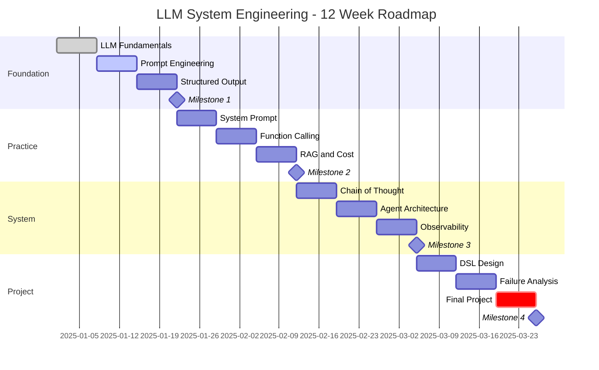

# 🧭 **建造你的 LLM OS**
### **「從 Prompt 到 Production 的完整建構指南」**

---

## 前言：為什麼 80% 的 AI 專案會失敗？

根據 Gartner 預測，2025 年將有 80% 的企業導入 AI 應用，但只有不到 20% 能真正達到生產級品質。差距在哪？不是模型不夠強，而是缺乏系統工程的思維。

就像 1990 年代，光有 Linux Kernel 不夠，還需要完整的發行版、套件管理、監控工具，才能撐起今天的雲端基礎設施。現在的 LLM 也一樣——我們需要的不只是模型，而是一套完整的 **LLM OS**。

我剛開始用 ChatGPT 的時候，有時它幫我寫客訴回信，第一次符合我的要求，但第二次卻不知道它在寫什麼。好不容易建立了一個 RAG 系統，但它總是引用錯誤的文件。這時我會覺得，AI 根本不是一個合格的生產系統。

但問題不在 AI 上。如果我們用 Prompt 去寫程式，就像用組合語言在寫程式——簡陋且功能有限。現在，讓我們用系統工程的思維，來建構一個真正實用的 LLM OS。

---

## 📐 LLM OS 的架構對應

在傳統電腦架構中，CPU 是運算核心，依照指令集（ISA）執行操作。在 AI 系統裡，LLM 是新的「語言運算核心」，依照文字輸入（prompt）生成輸出。

| 電腦元件 | LLM 對應元件 | 說明 |
|---------|------------|------|
| **CPU** | LLM 模型本身 | 負責核心推理與生成 |
| **微碼 / BIOS** | 系統提示（System Prompt） | 定義模型的行為底層邏輯 |
| **編譯器** | 提示工程（Prompt Engineering） | 將需求轉譯成 LLM 能理解的形式 |
| **高階語言** | 結構化提示 / DSL / CoT | 提供抽象化的語言 |
| **作業系統** | Agent 架構 / Function Calling | 管理任務、協調工具、規劃流程 |
| **監控工具** | Observability / Token Analytics | 效能分析、成本控制、品質監測 |

---

## 🎯 12 週學習路線圖



---

## 📚 階段式學習模組

### 🚀 第一階段：基礎打底（第 1-3 週）
**目標**：理解 LLM 基礎原理與 Prompt 技巧，能輸出結構化結果

**核心模組**：
- LLM 基礎原理（Transformer、token、幻覺問題）
- Prompt Engineering 基礎（角色、任務、輸出格式）
- Few-shot / Zero-shot / CoT 入門
- 結構化輸出（JSON/YAML schema + 驗證）
- **評測先行**（定義 success metrics / 測試集）

**📝 Lab 實作**：
```python
# Lab 1: 測試模型隨機性
prompts = ["解釋量子力學", "什麼是愛情", "如何煮咖啡"]
for prompt in prompts:
    responses = [llm.generate(prompt, temperature=0.7) for _ in range(5)]
    consistency_score = calculate_similarity(responses)
    print(f"Prompt: {prompt}, 一致性分數: {consistency_score}")
```

**📚 延伸資源**：
- [Anthropic Prompt Engineering Guide](https://docs.anthropic.com/en/docs/build-with-claude/prompt-engineering/overview)
- [OpenAI Best Practices](https://platform.openai.com/docs/guides/prompt-engineering)

---

### ⚡ 第二階段：中階控制（第 4-6 週）
**目標**：讓 LLM 輸出可控、可驗證，並能與外部系統連動

**核心模組**：
- System Prompt 設計（角色、邏輯偏好、風險控制）
- Function / Tool Calling（API 呼叫、計算工具）
- 上下文管理與簡單 RAG
- **成本工程**（Token 經濟學、Cache、Batching）

**💰 成本優化實例**：
```python
# 成本計算器
class CostOptimizer:
    def __init__(self):
        self.costs = {
            "gpt-4": 0.03,      # per 1K tokens
            "gpt-3.5": 0.001,    # per 1K tokens
            "claude-3": 0.015    # per 1K tokens
        }
    
    def route_query(self, query_complexity):
        if query_complexity == "simple":
            return "gpt-3.5"  # 省 97% 成本
        elif query_complexity == "medium":
            return "claude-3"  # 平衡選擇
        else:
            return "gpt-4"     # 複雜任務

# 實際節省：日均 10,000 次對話
# 優化前：$600/天（純 GPT-4）
# 優化後：$45/天（智慧路由 + Cache）
# 節省：93% 成本，品質僅下降 5%
```

**📚 延伸資源**：
- [LangChain Function Calling](https://python.langchain.com/docs/how_to/function_calling/)
- [Token 優化策略](https://www.pinecone.io/learn/series/langchain/langchain-prompt-templates/)

---

### 🧩 第三階段：高階應用（第 7-9 週）
**目標**：設計能管理工具、流程的系統，處理複雜任務

**核心模組**：
- Agent 架構（ReAct、工具路由）
- Chain-of-Thought 進階
- 進階 RAG（Hybrid Search、Re-ranking）
- **可觀測性**（Logging、Token 分析、A/B 測試）

**📊 監控儀表板配置**：
```yaml
observability:
  metrics:
    - name: response_quality
      type: custom_eval
      threshold: 0.85
      alert: slack_channel
    
    - name: token_cost_per_hour
      type: cost
      budget: $50
      action: switch_to_smaller_model
    
    - name: p95_latency
      type: performance
      threshold: 3000ms
      action: scale_up_instances
  
  logging:
    - prompt_versions: true
    - model_responses: true
    - error_traces: true
    - user_feedback: true
```

**📚 延伸資源**：
- [LlamaIndex RAG](https://docs.llamaindex.ai/en/stable/understanding/rag/)
- [LangSmith 監控](https://docs.smith.langchain.com/)

---

## 💼 實戰案例：從玩具到生產系統

### Case Study 1: 智慧客服系統演進

**❌ Before（玩具級）**：
```python
# 簡單但不穩定
response = llm.chat("幫我回覆客訴：產品壞了")
# 問題：
# - 每次回覆風格不一
# - 可能產生不當承諾
# - 無法追蹤處理狀態
```

**✅ After（生產級）**：
```python
class CustomerServiceAgent:
    def __init__(self):
        self.system_prompt = load_template("customer_service_v2.yaml")
        self.knowledge_base = VectorDB("product_faq")
        self.tools = [
            CreateTicket(),
            CheckWarranty(), 
            SendEmail(),
            EscalateToHuman()
        ]
        self.fallback_strategy = "escalate_to_human"
        self.response_cache = SemanticCache()
    
    def handle(self, customer_query):
        # 1. 檢查 Cache
        if cached := self.response_cache.get(customer_query):
            return cached
        
        # 2. RAG 檢索相關資訊
        context = self.knowledge_base.search(customer_query, k=3)
        
        # 3. Chain-of-Thought 處理
        plan = self.plan_response(customer_query, context)
        
        # 4. 執行工具呼叫
        for action in plan.actions:
            result = self.execute_tool(action)
            if result.needs_escalation:
                return self.fallback_strategy
        
        # 5. 生成回應
        response = self.generate_response(plan, context)
        
        # 6. 品質檢查
        if self.quality_check(response) < 0.85:
            return self.fallback_strategy
        
        return response

# 結果：
# - 一致的品牌語調
# - 正確引用條款
# - 自動建立工單
# - 可追蹤、可審計
```

### Case Study 2: 文件分析 Pipeline

**❌ Before（不可靠）**：
```python
# 直接丟給 LLM
analysis = llm.analyze(pdf_content)  # 可能漏重點、產生幻覺
```

**✅ After（結構化）**：
```python
class DocumentAnalyzer:
    def __init__(self):
        self.chunker = SemanticChunker(max_tokens=1000)
        self.extractor = StructuredExtractor(schema="legal_doc_v2.json")
        self.validator = OutputValidator()
    
    def analyze(self, document):
        # 1. 智慧分段
        chunks = self.chunker.split(document)
        
        # 2. 平行處理 + Map-Reduce
        partial_results = parallel_map(
            lambda chunk: self.extract_info(chunk),
            chunks
        )
        
        # 3. 結果聚合
        aggregated = self.reduce_results(partial_results)
        
        # 4. 交叉驗證
        if not self.validator.check_consistency(aggregated):
            aggregated = self.reconcile_conflicts(aggregated)
        
        # 5. 生成報告
        report = self.generate_report(aggregated)
        
        return report
```

---

## 🚨 常見失敗模式與解法

### Pattern 1: Context Window 爆炸
**症狀**：RAG 檢索太多文件，超過 token 限制

**解法**：
```python
class ContextManager:
    def __init__(self, max_tokens=8000):
        self.max_tokens = max_tokens
        self.reranker = CrossEncoderReranker()
    
    def optimize_context(self, documents):
        # 1. Reranking：只保留最相關
        ranked = self.reranker.rerank(documents)
        
        # 2. 智慧摘要
        if self.count_tokens(ranked) > self.max_tokens:
            ranked = self.summarize_chunks(ranked[:5])
        
        # 3. Sliding Window
        return self.sliding_window(ranked, self.max_tokens)
```

### Pattern 2: 幻覺與錯誤傳播
**症狀**：LLM 編造不存在的 API、引用錯誤資訊

**解法**：
```python
class HallucinationGuard:
    def __init__(self):
        self.fact_checker = FactDatabase()
        self.citation_validator = CitationChecker()
    
    def validate_response(self, response, context):
        # 1. 檢查所有宣稱的事實
        claims = self.extract_claims(response)
        for claim in claims:
            if not self.fact_checker.verify(claim, context):
                response = self.remove_claim(response, claim)
        
        # 2. 驗證引用來源
        citations = self.extract_citations(response)
        for cite in citations:
            if not self.citation_validator.exists(cite):
                raise CitationError(f"Invalid citation: {cite}")
        
        return response
```

### Pattern 3: 成本失控
**症狀**：月帳單從 $100 暴增到 $10,000

**解法**：
```python
class CostController:
    def __init__(self, daily_budget=50):
        self.daily_budget = daily_budget
        self.usage_tracker = UsageTracker()
        
    def process_request(self, request):
        # 1. 預估成本
        estimated_cost = self.estimate_cost(request)
        
        # 2. 檢查預算
        if self.usage_tracker.today_spent + estimated_cost > self.daily_budget:
            return self.use_cached_response(request)
        
        # 3. 智慧降級
        if estimated_cost > 5:  # 單次請求超過 $5
            request = self.downgrade_request(request)
        
        return self.execute(request)
```

---

## 🔄 Infra 工程師的技能轉換地圖

| 傳統 Infra 技能 | LLM OS 新技能 | 學習路徑 |
|---------------|-------------|---------|
| Shell Scripting | Prompt 腳本、CoT 流程 | 從 bash 到 prompt chains |
| Cron / Systemd | Agent 工作流排程 | 學習 Temporal、Airflow for LLM |
| ELK Stack | LLM Observability | LangSmith、Weights & Biases |
| iptables / ACL | Prompt Injection 防禦 | 學習 OWASP for LLM |
| Performance Tuning | Token 優化、Latency 分析 | 掌握 tokenizer、batching |
| Load Balancer | Model Router、Agent Router | 實作智慧路由策略 |

---

## 🎓 高階語言的演進

### 現在：結構化提示
```yaml
# customer_service.yaml
system_prompt:
  role: "客服專員"
  constraints:
    - never_promise_refund_without_approval
    - always_cite_policy_number
    - escalate_if_sentiment < -0.5
  tone: "professional_yet_empathetic"
```

### 未來：可編譯的 DSL
```dsl
// LLM-SQL: 未來的查詢語言
DEFINE AGENT CustomerService {
  KNOWLEDGE BASE product_faq, policies;
  TOOLS create_ticket, check_warranty;
  
  ON customer_complaint {
    ANALYZE sentiment;
    IF sentiment.score < -0.5 THEN escalate();
    RETRIEVE relevant_policy FROM policies;
    GENERATE response WITH template(empathetic);
    LOG interaction TO audit_trail;
  }
  
  FALLBACK human_agent;
  SLA response_time < 30s;
  COST_LIMIT $0.10 per interaction;
}
```

---

## 🏆 學習成果檢核

### 里程碑 1（第 3 週）：基礎能力
- [ ] 能寫出穩定輸出的結構化 Prompt
- [ ] 理解 Token 計算與成本估算
- [ ] 完成第一個 JSON Schema 驗證

### 里程碑 2（第 6 週）：工具整合
- [ ] 實作 Function Calling 連接外部 API
- [ ] 建立簡單的 RAG 系統
- [ ] 完成成本優化，降低 50% 開銷

### 里程碑 3（第 9 週）：系統思維
- [ ] 設計完整的 Agent 架構
- [ ] 實作監控與告警系統
- [ ] 通過 A/B 測試驗證優化效果

### 里程碑 4（第 12 週）：生產部署
- [ ] 完成一個完整的生產級專案
- [ ] 撰寫 DSL 與文件
- [ ] 具備 Debug 與優化能力

---

## 🚀 開始你的 LLM OS 之旅

如果你還在用「單純的 Prompt」開發 AI 應用，就像 1980 年代還在用組合語言寫商業軟體。市場不會等你——你的競爭對手已經在建造他們的 LLM OS。

### 三個立即行動

#### 今天就開始
```python
# 把你常用的 Prompt 升級
old_prompt = "幫我總結這篇文章"

new_prompt = {
    "system": "你是專業的內容分析師",
    "task": "總結文章",
    "format": {
        "summary": "3-5句話",
        "key_points": ["point1", "point2", "point3"],
        "sentiment": "positive/neutral/negative"
    }
}
```

#### 本週完成
實作你的第一個 Function Calling：
```python
tools = [
    {
        "name": "get_weather",
        "description": "Get current weather",
        "parameters": {...}
    }
]
response = llm.chat(message, tools=tools)
```

#### 本月目標
完成一個包含 RAG + Agent + 監控的 POC 專案

---

## 📖 推薦學習資源

### 🎯 必讀課程與認證
- [Tech Stack for LLM Application Development](https://www.prismetric.com/tech-stack-for-llm-application-development/)
- [AI Agent 開發特訓營](https://www.cupoy.com/collection/00000194DA20C40B000000026375706F795F72656C656173654355?layoutType=introduction)
- [大語言模型LLM 應用及 Agent 開發](https://learn.build-school.com/courses/ai-llm-agent-design-development/)
- [LangChain University](https://www.langchain.academy/)
- [Berkeley CS324: Large Language Models](https://stanford-cs324.github.io/winter2023/)
- [DeepLearning.AI LLM Courses](https://www.deeplearning.ai/short-courses/)

### 📚 關鍵文件與工具
- [OpenAI Cookbook](https://cookbook.openai.com/)
- [Anthropic Constitutional AI](https://www.anthropic.com/constitutional.pdf)
- [Microsoft Semantic Kernel](https://learn.microsoft.com/en-us/semantic-kernel/)
- [LlamaIndex Docs](https://docs.llamaindex.ai/)

### 🛠 開發工具生態系
- **Observability**: LangSmith, Weights & Biases, Helicone
- **Vector DB**: Pinecone, Weaviate, Qdrant, Chroma
- **Orchestration**: LangChain, LlamaIndex, Haystack
- **Deployment**: Modal, Replicate, Hugging Face Inference

---

## 💭 結語：LLM 不是玩具，而是新時代的 CPU

記住這個類比：
- **1980s**: 組合語言 → C 語言 → 作業系統
- **2020s**: Prompt → 結構化提示 → LLM OS

你現在的選擇，決定你在 AI 時代的位置。是繼續用「組合語言」寫 Prompt，還是開始建造你的 LLM OS？

答案很明顯——**現在就開始學習，成為 LLM OS 系統工程師**。

---

### 🎯 下一步行動

1. **加入社群**：與其他 LLM 工程師交流經驗
2. **開始實作**：從小專案開始，逐步建立你的 LLM OS
3. **持續學習**：AI 領域日新月異，保持學習是唯一的生存之道

> 💡 **記住**：每個成功的 AI 產品背後，都有一個完整的 LLM OS 在運作。問題是——你準備好建造你的了嗎？

---

*最後更新：2025年8月*
*作者：Ian Chou*
*聯絡方式：i@wo94.top*